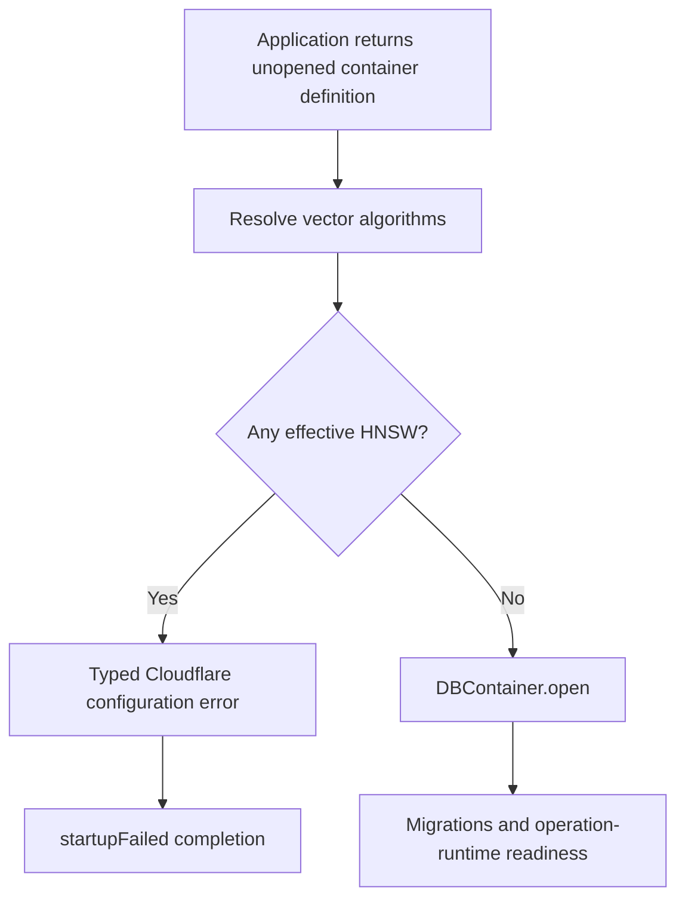

# ADR-0002: Cloudflare Vector Index Capabilities

- Status: Accepted
- Date: 2026-08-02
- Scope: `VectorIndexes` applications hosted by Cloudflare Workers and Durable Objects

## Context

`database-framework` owns one coherent `VectorIndexes` feature containing
Flat, HNSW, IVF, and PQ. Splitting HNSW into a peer product, backend trait, or
runtime layer would break that semantic hierarchy and expose a host constraint
as a framework API.

Cloudflare Workers limits each isolate to 128 MB. The limit includes the
JavaScript heap and WebAssembly allocations and can be shared by concurrent
work handled by the isolate. The current authoritative limit is documented at
<https://developers.cloudflare.com/workers/platform/limits/#memory>.

HNSW requires a live graph in memory. Restore and update may also retain the
persisted archive input, decoded graph storage, vector owners, and replacement
snapshot concurrently. A graph fitting in one fixture does not establish a
safe production budget for the reactor, host bridge, SQLite response buffers,
application state, and concurrent isolate work.

## Decision

The package and trait hierarchy remains unchanged. Cloudflare narrows only the
execution capability:

| Algorithm | Cloudflare status | Bootstrap behavior |
| --- | --- | --- |
| Flat | Supported | Container may open |
| IVF | Supported | Container may open |
| PQ | Supported | Container may open |
| HNSW | Unsupported | Typed failure before container opening |

The runtime resolves the canonical execution options for every configured
vector index before `DBContainer.open`. Every configuration that resolves to
HNSW is rejected, including a custom `IndexRuntimeConfiguration`. A vector
index with no runtime configuration uses the framework default, Flat.
Validation precedes migrations, persisted graph reads, graph allocation, and
index initialization.

There is no fallback. An HNSW declaration is never executed as Flat, IVF, or
PQ, because doing so would change persistence layout, performance, recall, and
operational semantics without application consent.

`SwiftHNSW` remains linked when `VectorIndexes` is selected. Link composition
describes framework capability, while this ADR describes the stricter
Cloudflare host capability.

## Verification Contract

Release verification must prove all of the following:

1. Flat, IVF, and PQ execute real write, maintenance, query, and delete paths
   in the Embedded Cloudflare reactor.
2. Explicit HNSW configuration returns the typed bootstrap failure before
   container opening.
3. A custom vector runtime configuration cannot bypass the same canonical
   resolution and rejection path.
4. HNSW rejection does not mutate storage or initialize an index.
5. No branch substitutes another vector algorithm.
6. The `VectorIndexes` artifact still links `VectorIndex` and `SwiftHNSW`.

## Consequences

- Applications deploying to Cloudflare may use the default Flat algorithm or
  explicitly select Flat, IVF, or PQ. They must not select HNSW.
- HNSW remains available to native and unconstrained WASM hosts.
- Raising Cloudflare support in the future requires a new decision backed by a
  measured whole-isolate memory budget for restore, search, mutation, snapshot
  persistence, runtime baseline, and concurrent host work. A small successful
  fixture is insufficient.
