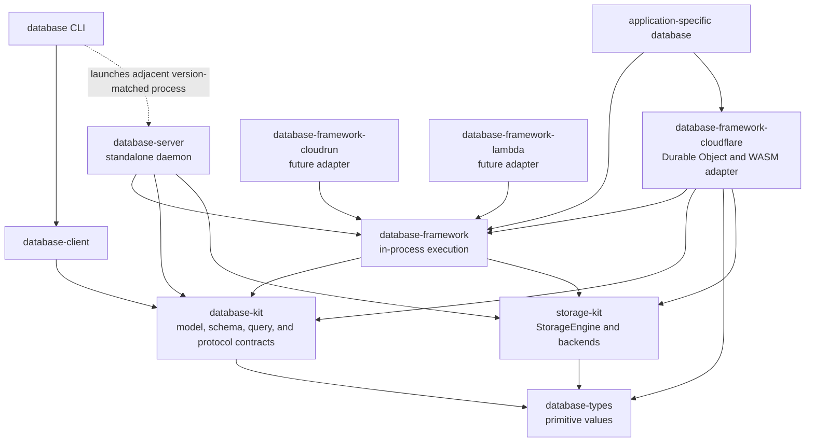
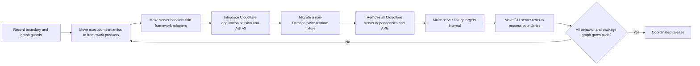
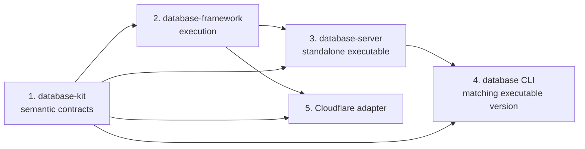

# ADR-0003: Framework Adapter and Standalone Server Boundaries

- Status: Accepted
- Date: 2026-08-16
- Supersedes: [ADR-0001](ADR-0001-full-runtime-reactor-abi.md)
- Implementation status: Ownership migration, coordinated dependency releases,
  native and Embedded WASM behavior, workerd persistence, and versioned Worker
  distribution verified for release `26.0818.0`

## Context

Three products have different reasons to change:

- `database-framework` is the lightweight, in-process database execution
  framework used to build application-specific databases.
- `database-server` is the standalone database daemon launched by the
  version-matched `database` command and kept alive for local stdio or remote
  HTTP and WebSocket use.
- `database-framework-cloudflare` is a Cloudflare platform adapter used with
  `database-framework` to run an application-specific database in a Durable
  Object and an Embedded Swift WASM reactor.

The previous architecture treated the Foundation-independent portion of the
standalone server as a reusable hosting runtime. Cloudflare therefore depended
on `DatabaseServerRuntime`, created `DatabaseOperationInstance`, exposed a
mandatory DatabaseWire request boundary, and adopted the standalone server's
operation registry, durable jobs, and authorization model.

That decision conflated two independent forms of reuse:

1. reusing database execution semantics; and
2. reusing the standalone server product.

Only the first form is required. A Cloudflare application needs
`database-framework` execution and Cloudflare platform services. It does not
need the standalone server.

Moving the complete operation runtime into `database-framework` is also not an
acceptable correction. That approach makes every framework consumer carry
remote operation dispatch, DatabaseWire framing, durable server jobs, and
server administration behavior. The framework must remain lightweight, with
optional feature implementations entering the graph only when the application
selects them.

Future packages such as `database-framework-cloudrun` and
`database-framework-lambda` will have the same architectural position as the
Cloudflare adapter. They are peers, not server variants and not dependencies of
one another.

## Decision

The architecture uses four independent ownership boundaries:

1. `database-kit` owns database declarations and portable semantic contracts.
2. `database-framework` owns in-process database execution.
3. `database-server` owns the complete standalone server application.
4. Each `database-framework-<platform>` package owns only its platform adapter.

`database-framework-cloudflare` has no dependency on `database-server` or any
product exported by that package. The Cloudflare adapter invokes an
application-owned session over opaque request and context bytes. It does not
interpret DatabaseWire, authentication principals, remote commands, or server
job state.

`database-server` may retain internal targets for testability and source
organization, but its supported public artifact is the standalone
`database-server` executable.

Database execution implementations currently located in `database-server`
are moved to the appropriate core or optional `database-framework` product.
DatabaseWire handlers remain in `database-server` and translate requests to
those framework APIs. A type is not moved merely because it invokes a framework
algorithm: DTO mapping, continuation encoding, response paging, and remote
administration orchestration remain server responsibilities while they are
defined by the DatabaseWire operation contract.

## Implemented Source State

The source migration implements the decision as follows. Runtime evidence is
tracked separately in the verification matrix below.

| Boundary | Implemented source state |
|---|---|
| Framework entity execution | Expression evaluation, entity mutation, SQL statement mutation, idempotency state, and logical mutation versioning are owned by `database-framework/DatabaseEngine`. |
| Framework graph execution | RDF document persistence and SPARQL update execution are owned by `database-framework/GraphIndex`. Graph algorithms, ontology reasoning, and SHACL validation remain implemented by the existing `GraphIndex` and `OntologyIndex` primitives. |
| Portable execution contracts | `ExecutionBudget` and `SchemaFingerprint` are owned by `database-kit/DatabaseKit`. `DatabaseWire` supplies only their binary conformances. Optional `GraphIndex` and the `Database` facade no longer declare a direct `DatabaseWire` target dependency. |
| Standalone server | `database-server` exports only the `database-server` executable. Its internal targets own DatabaseWire DTO mapping, response paging, remote ontology and SHACL administration orchestration, persistent server jobs, and native process hosting. They call framework graph, ontology, and SHACL primitives rather than reimplementing them. |
| CLI process boundary | The `database` CLI depends on `database-client`, locates the adjacent version-matched server through `DatabaseServerInstallation`, and launches `database-server` as a child process. It does not link server implementation targets. |
| Cloudflare adapter | `database-framework-cloudflare` depends on database-framework, database-kit semantic declarations, database-types, and storage-kit. Its public runtime accepts an application-defined session and opaque request/context bytes through private reactor ABI v3. |

The ownership move also changes two persisted framework formats. Mutation
state manifest v2 uses framework-owned discriminator and fingerprint fields,
and RDF document metadata v2 uses the framework `StorageFrame` codec. The
former server-owned v1 encodings are rejected explicitly; they are not decoded
as v2 and no compatibility reader is retained during initial development.

`DatabaseServerRuntime.o` and the standalone server's operation and host
objects intentionally remain named in the Cloudflare reactor link verifier's
forbidden-object list. Their presence there is a negative graph assertion.
`DatabaseWire.o` is not such an assertion because `DatabaseEngine` still uses
three canonical codec services internally: schema-manifest hashing compatible
with remote schema administration, QueryIR bytes used to bind continuation
tokens to a query, and exact encoded-size accounting for relational values.
These uses do not expose operation requests, response pages, dispatch, jobs,
transport behavior, or `DatabaseWireError` from the framework. Codec failures
are translated at the internal boundary into `SchemaFingerprintError`,
`CanonicalReadError`, `QueryCursorError`, or
`DatabaseIntermediateFootprintError`. `ExecutionBudget` and
`SchemaFingerprint` themselves are semantic `DatabaseKit` values. The adapter
does not decode DatabaseWire or make it part of ABI v3. References to ABI v2
and the former `DatabaseServerRuntime` dependency in ADR-0001 are retained only
as a superseded historical decision.

## Target Dependency Direction

Arrows point from consumer to dependency.



The platform adapters do not depend on `database-server`. The framework does
not depend on the server or a platform adapter.

## Responsibility Boundaries

| Owner | Responsibilities |
|---|---|
| Application | Concrete models, schema, migrations, selected features, request codec, authorization mapping, application routing, and application alarm behavior |
| `database-kit` | Persisted model metadata, schema and identity declarations, query and mutation language models, graph and ontology declarations, and the optional DatabaseWire contract |
| `database-framework` | `DBContainer`, transactions, persistence, query and mutation execution, indexes, relationships, graph execution, ontology, SHACL, schema transitions, maintenance primitives, security enforcement, and authoritative storage ownership |
| `database-server` | DatabaseWire decoding and encoding, operation registry and handlers, remote commands, durable query snapshots, persistent server jobs, schema administration endpoints, HTTP, WebSocket, stdio, TLS, credentials, signals, process lifecycle, and native backend composition |
| `storage-kit` | Storage transaction contracts and concrete storage adapters, including Durable Object SQLite host storage |
| `database-framework-cloudflare` | Durable Object lifecycle, persistent WASI reactor lifecycle, FIFO admission, completion correlation, bounded byte transfer, StorageKit host ABI, Swift task scheduling, clocks, random values, alarm scheduling and delivery, and Cloudflare capability validation |

## Framework Semantic Placement

The ownership correction is not a bulk move of `DatabaseServerRuntime` back
into the framework. Declarations are split by represented behavior.

| Current server area | Final owner |
|---|---|
| Expression evaluation and ordinary query execution | `database-framework` core query execution |
| Entity mutation preparation, preconditions, idempotency, and transactional effects | `database-framework` core mutation execution |
| Graph query planning and RDF execution | Graph-selected `database-framework` product |
| Ontology reasoning | Graph/ontology-selected `database-framework` product |
| SHACL validation | Graph/SHACL-selected `database-framework` product |
| Index status, rebuild slices, and migration execution primitives | `database-framework` maintenance APIs and selected index products |
| Base and Composition execution semantics | `database-framework` under the non-default `MultipleBases` trait |
| DatabaseWire frame decoding and response encoding | `database-server` |
| Operation registry, remote handler selection, and remote error mapping | `database-server` |
| Durable response snapshots and server job persistence | `database-server` |
| HTTP, WebSocket, stdio, TLS, credentials, and process shutdown | `database-server` |

The framework expresses its execution contract without remote operation DTOs.
The server maps DatabaseWire operation DTOs into framework requests, passes the
portable `ExecutionBudget`, and maps typed framework outcomes back to
DatabaseWire responses.

Heavy feature implementations remain in separate SwiftPM targets. The default
framework dependency selects no backend, graph runtime, vector implementation,
full-text implementation, relationship runtime, or `MultipleBases` support.

## Application-Facing Cloudflare Contract

The implemented application API is protocol-based. These names and ownership
boundaries are the accepted contract for this migration.

```swift
public protocol CloudflareDatabaseApplication: Sendable {
    associatedtype Session: CloudflareDatabaseSession

    func makeDefinition() async throws -> CloudflareDatabaseDefinition

    func makeSession(
        for container: DBContainer
    ) async throws -> Session
}

public protocol CloudflareDatabaseSession: Sendable {
    func respond(
        to invocation: CloudflareDatabaseInvocation
    ) async throws -> ByteString

    func handleAlarm() async throws

    func shutdown() async
}

public struct CloudflareDatabaseInvocation: Sendable {
    public let context: ByteString
    public let request: ByteString
}
```

`handleAlarm()` has a default implementation that throws the typed
`alarmHandlingUnavailable` session error. Applications that own alarm work
override the method directly. Type erasure uses the session protocol witness;
it does not discover alarm support through runtime casting, so the same path
is valid in Embedded Swift.

`CloudflareDatabaseDefinition` contains the application-selected schema,
migration plan, runtime configuration, security configuration, index runtime
configuration, logging, and metrics. It does not contain a server operation
registry or a DatabaseWire endpoint.

The Cloudflare adapter creates the platform StorageEngine and clocks, validates
Cloudflare capabilities, opens `DBContainer`, and asks the application to make
its session. If definition creation, capability validation, container opening,
or session creation fails, the adapter completes authoritative storage cleanup
before returning failure.

The application session may retain `DBContainer` for database operations. The
adapter runtime remains the authoritative shutdown owner and calls session
shutdown before `DBContainer.shutdown()`.

## Opaque Invocation Boundary

The TypeScript Durable Object exposes an opaque invocation API equivalent to:

```ts
invoke(requestBytes: Uint8Array, contextBytes: Uint8Array): Promise<Uint8Array>
```

The application Worker owns external routing, content type validation,
credential authentication, and encoding of application context. The adapter
validates only ownership, byte limits, queue capacity, lifecycle state, and
completion state.

The two buffers remain separate so an application can transfer request and
authenticated context without consolidating them into an additional envelope.
Neither buffer has a package-defined semantic format.

DatabaseWire remains available from `database-kit` when an application
explicitly chooses it. Selecting DatabaseWire does not install the standalone
server operation registry. A future requirement to run the complete standalone
server contract on Cloudflare would be represented by a separate product or
package rather than expanding the base Cloudflare adapter.

## Private Reactor ABI

The semantic change creates private reactor ABI v3. ABI v2 compatibility is not
retained.

The allocation, completion, task scheduling, clock, standard WASI, storage,
and shutdown services remain platform infrastructure. The invocation export
consumes opaque context and request allocations. The alarm export delivers one
platform wake-up to an application alarm handler and does not imply a
persistent server job. Random bytes are provided by WASI `random_get`; ABI v3
does not define a custom database randomness service.

The application executable constructs `CloudflareDatabaseRuntimeEntrypoint`
with its concrete `CloudflareDatabaseApplication` and owns the thin WASM export
shims. The adapter library owns the reusable entrypoint state machine and ABI
contract. This keeps application schema and composition out of the adapter
while avoiding a generic server executable inside the Cloudflare package.

The adapter completion status space contains lifecycle and host failures only.
DatabaseWire-specific statuses such as `invalidRequestFrame` are removed.
Application protocol failures that callers must observe are encoded by the
application into its response payload. A thrown application error is an
explicit failed invocation and is never converted into an empty or synthetic
success.

## Lifecycle and Ownership

| State | Creator | Authoritative owner | Terminal action |
|---|---|---|---|
| Durable Object SQLite host | TypeScript adapter | Durable Object generation | Released with the generation |
| WASM reactor | TypeScript adapter | Durable Object generation | Aborted on terminal ABI or timeout failure |
| Cloudflare StorageEngine | Swift adapter | Transferred through `DBConfiguration` to `DBContainer` | `DBContainer.shutdown()` |
| `DBContainer` | Swift adapter bootstrap | Cloudflare runtime actor | Shutdown after admitted work drains |
| Application session | Application | Cloudflare runtime actor | Session shutdown before container shutdown |
| Request and context allocations | TypeScript connection, then Swift after transfer | Explicit current owner | Released exactly once on completion or failure |
| Completion payload | Swift for the synchronous completion call | Copied once into TypeScript-owned storage | Released when the call returns |
| Durable Object alarm | TypeScript adapter | Durable Object storage | Cleared or replaced only after application handling succeeds |

`DBContainer` is the only operational owner of the transferred StorageEngine.
The application does not retain a raw engine path and does not independently
request engine shutdown.

## Concurrency and Failure Contracts

- TypeScript admits startup, invocation, alarm, and shutdown through one bounded
  FIFO owner.
- Swift uses one actor-owned runtime state machine and does not concurrently
  enter the application session.
- Initialization under `blockConcurrencyWhile` includes only storage host
  migration, reactor instantiation, capability validation, container opening,
  and session creation.
- A failed cached initialization is cleared so a later Durable Object
  generation can retry from durable state.
- Shutdown stops admission, drains accepted work, shuts down the application
  session, and awaits authoritative container shutdown. The shutdown command
  has reserved admission even when the ordinary call registry is full; calls
  submitted after shutdown begins are rejected locally.
- Alarm failure escapes to Cloudflare so the platform can retry it. The adapter
  does not implement application retry or persistent job policy.
- Ownership, address, timeout, and completion-correlation violations terminate
  the reactor generation.
- Application request failures remain nonterminal unless the application or a
  typed runtime invariant declares the session unusable.
- An unclassified thrown application error remains `applicationFailed` and is
  exposed by the Worker as `database.execution.runtime_failure`; the host does
  not reinterpret it as an invalid application request. Cancellation remains
  the distinct `database.execution.cancelled` outcome.
- Borrowed WebAssembly memory is used only during the synchronous borrow. Data
  that survives the borrow is copied once into its final owner.

## Standalone Server Packaging and Naming

The supported executable product remains `database-server`. Its SwiftPM target
and root command use domain names rather than build-artifact terminology.

| Element | Name |
|---|---|
| Executable product | `database-server` |
| Executable target | `DatabaseServer` |
| Root command type | `DatabaseServerCommand` |
| Root command source | `Sources/DatabaseServer/DatabaseServerCommand.swift` |
| CLI installation locator | `DatabaseServerInstallation` |

Internal server targets may retain precise names such as `DatabaseServerRuntime` and
`DatabaseServerHost` when those names describe their internal responsibility,
but they are not public library products.

The `database` CLI links `database-client`, locates the adjacent
version-matched `database-server` executable, and launches it. CLI production
targets do not link server implementation targets or storage backends.

## SwiftPM Trait Contract

- `database-framework` has no default traits.
- `database-framework-cloudflare` has no default runtime feature traits.
- The application selects its exact framework features.
- `AllRuntimeFeatures` remains an explicit convenience trait and does not
  enable `MultipleBases`.
- `database-server` may select its distribution feature closure when building
  the standalone release artifact.
- SwiftPM trait unification must not cause an adapter to select features on
  behalf of an application.

## Migration



The migration does not retain aliases for
`CloudflareDatabaseOperationApplication`, server authorization codecs, or the
ABI v2 operation path. Old paths are removed in the same completed change that
migrates all callers and tests.

ADR-0002 remains the Cloudflare vector capability decision. HNSW validation
continues to occur before `DBContainer.open`; it is applied to
`CloudflareDatabaseDefinition` rather than a server-owned container
definition.

## Coordinated Release Order

The repositories are released in dependency order. A downstream manifest must
raise its minimum version when its source requires an API introduced by this
migration; relying on a resolver to select a newer incidental version is not a
valid package contract.



Before each tag, the repository uses only URL dependencies and declares the
minimum released versions that contain every consumed API. The
`database-server` and `database` CLI release versions remain identical because
the CLI rejects a non-matching adjacent executable. Cloudflare is released
only after its framework and database-kit minimum versions resolve to the
verified source revisions. Tags are created from the corresponding remote
default-branch commit, never from a local-path verification graph.

## Verification Contract

Completion requires all of the following evidence:

1. The Cloudflare manifest, Swift sources, TypeScript sources, tests, and
   resolved graph contain no dependency on `database-server`.
2. The Cloudflare default trait set is empty.
3. A non-DatabaseWire application payload performs a real `DBContainer`
   write/read round trip through Durable Object SQLite.
4. Startup failure before and after container opening proves authoritative
   StorageEngine shutdown.
5. Request success, application failure, cancellation, queue capacity,
   timeout, alarm retry, shutdown drain, and Durable Object restart are tested
   through the production invocation path.
6. Embedded WASM compiles and links the application-selected feature closure
   using the pinned Swift toolchain and matching production SDK.
7. Unselected graph, vector, full-text, relationship, and `MultipleBases`
   implementations are absent from the linked artifact.
8. Standalone HTTP, WebSocket, stdio, authentication, durable job, schema
   administration, and process shutdown behavior remains covered in
   `database-server`.
9. The `database` CLI opens and serves databases by launching the adjacent
   version-matched `database-server` executable.
10. Package manifests use URL dependencies for release verification and contain
    no local path dependencies.
11. The Worker dependency graph resolves from versioned distribution artifacts.
    A sibling-checkout `file:` dependency is valid only for local development
    and is not release evidence.

### JavaScript distribution boundary

The JavaScript packages follow the same semantic ownership as their Swift
packages:

| Package | Distribution owner | Consumers |
|---|---|---|
| `@storage-kit/cloudflare-durable-object-storage-host` | `storage-kit` | Cloudflare platform adapters that need the StorageKit Durable Object SQLite host ABI |
| `@database-framework-cloudflare/cloudflare-database-runtime` | `database-framework-cloudflare` | Application Workers that host an application-owned database reactor |

Each package must have an immutable version, a reproducible package archive,
and a dependency graph that resolves without a sibling source checkout. The
Cloudflare runtime consumes the versioned StorageKit host package; it does not
copy or republish StorageKit source. Registry publication and immutable GitHub
release archives are both valid transports when their integrity is locked.

### Shared-state review matrix

The adapter keeps the same isolation contract in shared Native and WASM Swift
sources. Target-specific code exists only at the host ABI boundary; it does not
replace synchronized storage with raw mutable state.

| Logical state | Storage and isolation | Read entry points | Mutation entry points | Shutdown or release |
|---|---|---|---|---|
| Runtime lifecycle, container, session, and pending operations | `CloudflareDatabaseRuntime` actor on every target | `start`, `invoke`, `alarm`, `shutdown` | Actor-isolated lifecycle and FIFO processing methods | Application session shutdown completes before `DBContainer.shutdown()` |
| Synchronous ABI command admission | `Mutex<CommandState>` on every target | Capacity and closing checks in command entry points | `enqueue`, `shutdown`, and `finishCommand` | Accepted work drains through the task tail before runtime shutdown |
| Persistent WASM entrypoint composition | `Mutex<CloudflareDatabaseRuntimeCommandChannel?>` | Invocation, alarm, and shutdown entrypoints | Startup creates the channel once | Owned by the Durable Object reactor generation |
| Invocation allocation ownership | `Mutex<OwnershipState>` on every target; allocation is a WASM host-boundary capability | Reservation lookup and transfer | Reserve, consume, release, and retained-owner deinitialization | Exactly-once deallocation updates count and byte budgets before freeing memory |
| WASM monotonic waits | `Mutex<ClockService.State>` plus `Mutex<ScheduledWait.Phase>` | Host resume and task cancellation | Reserve, schedule, cancel, fire, and remove | Continuations resume exactly once; host cancellation removes the registered wait |
| WASM scheduled Swift jobs | `Mutex<TaskScheduler.State>` and one-time `Mutex<Bool>` hook installation | Host `run(taskID:)` | Reserve, schedule, and remove | The TypeScript scheduler invalidates pending callbacks when the runtime generation terminates |

No mutex critical section contains `await`, storage I/O, completion delivery, or
application callbacks. The two `nonisolated(unsafe)` declarations are the Swift
runtime's fixed delayed-task hook slots in the C ABI shim. They are installed
exactly once under `installationState` and do not represent application state.

The strict verification harnesses encode the reviewed logical test counts
below. Evidence was collected on 2026-08-18 with the pinned Swift snapshot and
URL-resolved package graphs. A passed test row means the report contained the
exact count with zero failures, skips, expected failures, runtime warnings, or
internal tool errors. Every row required for this release is complete.

| Repository / suite | Selected traits | Expected tests | Current evidence |
|---|---|---:|---|
| `database-kit` | Standard | 641 | Passed 641/641 |
| `database-kit` | `MultipleBases` | 656 | Passed 656/656 |
| `database-framework` SQLite | `SQLite,AllRuntimeFeatures` | 111 | Passed 111/111 |
| `database-framework` SQLite | `SQLite,AllRuntimeFeatures,MultipleBases` | 114 | Passed 114/114 |
| `database-framework` semantic suites | `DatabaseEngineTests,GraphIndexTests` | 603 | Passed 603/603 |
| `database-framework` PostgreSQL | `PostgreSQL,AllRuntimeFeatures,MultipleBases` | 72 | Passed 72/72 against an isolated PostgreSQL instance with negative readiness after shutdown |
| `database-framework` FoundationDB | `FoundationDB,AllRuntimeFeatures,MultipleBases` | 3,651 | Passed 3,651/3,651 against an isolated FoundationDB 7.3 cluster with negative readiness after shutdown |
| `database-server` | Standard | 279 | Passed 279/279 |
| `database-server` | `MultipleBases` | 305 | Passed 305/305 |
| `database-server` storage integration | SQLite, PostgreSQL, FoundationDB release artifact | — | Passed all three backends and negative readiness |
| `database` CLI | Standard | 45 | Passed 45/45 |
| `database` CLI | `MultipleBases` | 59 | Passed 59/59 |
| `database` CLI process and FDB integration | Version-matched executable set | — | Passed process lifecycle, link separation, and FDB 7.3 integration |
| `database-framework-cloudflare` Native | Standard | 18 | Passed 18/18 |
| `database-framework-cloudflare` Native | `MultipleBases` | 20 | Passed 20/20 |
| `database-framework-cloudflare` Native | `AllRuntimeFeatures` | 21 | Passed 21/21 |
| Cloudflare Worker dependency distribution | Versioned StorageKit host and Cloudflare runtime packages | — | Passed; the 39-entry, 24,428-byte `26.818.0` archive has SHA-256 `10af9694ae5444319b8769c1006d17ce0a8c4d054c739cec14fd9dc225687685`, a clean external consumer resolved the immutable StorageKit `26.817.0` release dependency, and Wrangler 4.123.0 bundled all public subpaths successfully |
| Cloudflare Worker TypeScript | Adapter test graph | 120 | Passed 120/120; production dependency audit reported zero vulnerabilities |
| Cloudflare Embedded WASM / workerd | `AllRuntimeFeatures` application reactor | — | Passed ABI v3, typed DBContainer write/read, Flat/IVF/PQ vector lifecycle, alarm delivery, workerd Durable Object RPC, and SQLite persistence after restart; 5,213,852 bytes raw, 1,849,720 bytes gzip, 64 MiB address space, and 30.500 ms startup |

Trait selection is part of the evidence. The package-owned harnesses create an
isolated source copy when a non-default trait graph is required, modify only
that copy, and reject local path dependencies for release verification. A
caller cannot substitute an expected-count environment variable for actually
selecting the corresponding trait graph.

## Consequences

- `database-framework` remains the reusable customization layer.
- Platform adapters remain replaceable and can be implemented independently by
  users.
- `database-server` is no longer an accidental SDK for platform adapters.
- Applications can choose DatabaseWire, another binary protocol, JSON, or a
  domain-specific codec without changing the Cloudflare host.
- Framework execution behavior has one implementation shared by in-process,
  standalone, Cloudflare, and future platform deployments.
- Optional feature boundaries, rather than package relocation, preserve the
  framework's lightweight default graph.
- No common cross-platform hosting package is introduced before at least two
  adapters demonstrate a stable shared contract.

## Rejected Alternatives

### Keep Cloudflare on `DatabaseServerRuntime`

This makes the standalone server's operation registry, DatabaseWire semantics,
durable jobs, and authorization policy mandatory platform adapter behavior.

### Move the complete server runtime into `database-framework`

This restores the dependency direction but makes the framework carry server
dispatch and lifecycle responsibilities. It repeats the original source of
framework growth.

### Duplicate database execution algorithms in each adapter

This gives query, mutation, graph, ontology, SHACL, and maintenance semantics
multiple owners and allows platform behavior to diverge.

### Create a shared hosting package immediately

One adapter does not establish a stable cross-platform abstraction. Each
adapter remains a peer package until Cloud Run, Lambda, or another host proves
which lifecycle contracts are genuinely common.
