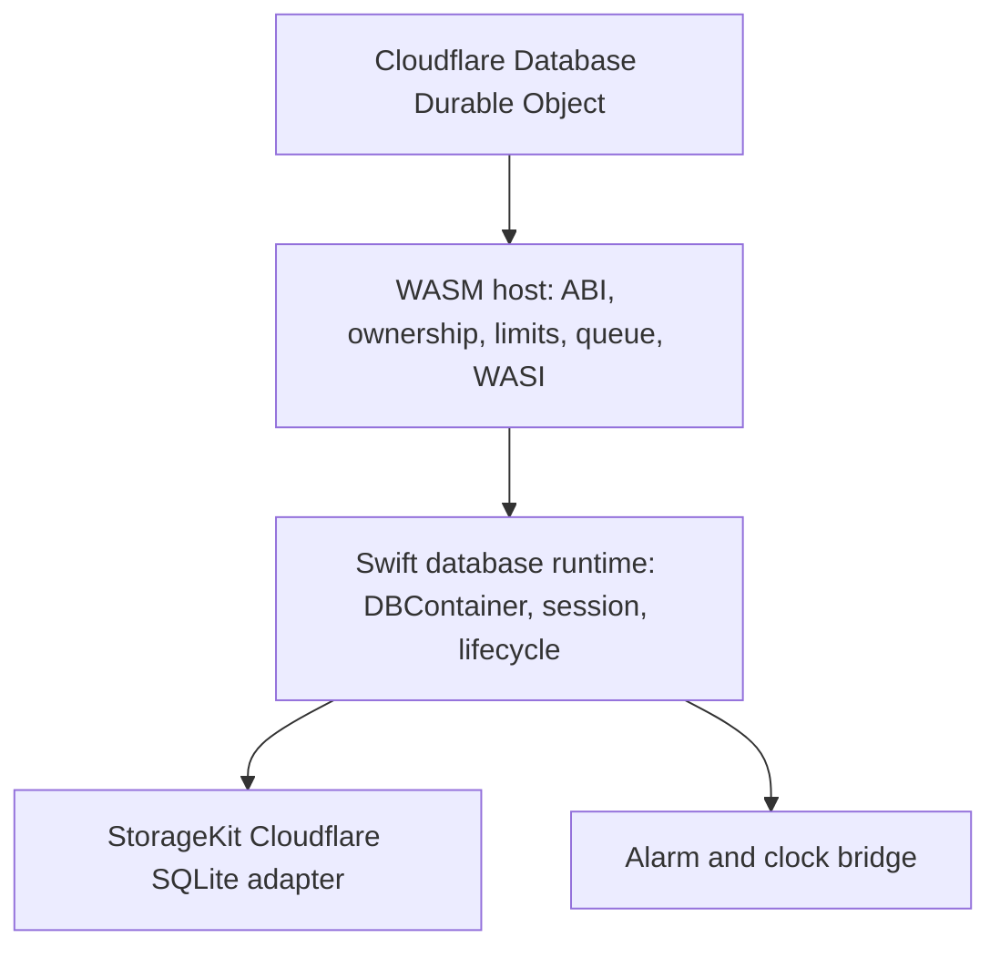
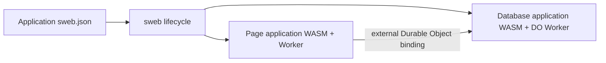

# ADR-0004: Cohesive Cloudflare Database Runtime Adapter

- Status: Accepted
- Date: 2026-08-19
- Supersedes: None
- Related: [ADR-0003](ADR-0003-framework-adapter-and-standalone-server-boundaries.md)

## Context

`database-framework-cloudflare` hosts an application-specific
`database-framework` runtime inside a Cloudflare Durable Object. The runtime
is a single persistent execution boundary: it opens the database container,
serves application invocations, forwards StorageKit operations to Durable
Object SQLite, resumes Swift tasks, delivers alarms, and completes or fails
calls through the reactor ABI.

These operations share lifecycle, ordering, memory ownership, timeout, and
failure invariants. Splitting them into unrelated packages would make the
Durable Object, the WASM host, and the Swift runtime coordinate those
invariants through additional public contracts.

Cloudflare Durable Objects have actor-like platform semantics: a named object
owns state and durable storage and processes work in a serialized execution
context. That does not make the database runtime a Swift
`DistributedActor`, and it does not make this package a SwiftWeb actor host.

## Decision

`database-framework-cloudflare` remains one cohesive Cloudflare database
adapter. It may contain the following tightly coupled implementation layers:



The package owns:

- Durable Object initialization, persistence, and shutdown coordination;
- the private reactor ABI and exact byte ownership rules;
- bounded request admission, FIFO ordering, timeout, and completion delivery;
- the WASI, clock, task scheduling, and executor bridges required by the
  Embedded WASM runtime;
- the StorageKit Durable Object SQLite host adapter;
- alarm delivery and recovery coordination for the active database runtime;
- the application-facing composition contract for database configuration and
  session;
- a generic `sweb` service adapter that generates and operates an independent
  database Worker without linking the database runtime into the page Worker.

The package does not own:

- application schemas, migrations, query or command meaning;
- DatabaseWire interpretation or application request routing;
- authentication, principal interpretation, or application security policy;
- the standalone `database-server` process;
- SwiftWeb `App`, `Scene`, `Environment`, `WebActorSystem`, or `ActorGroup`;
- application-specific Worker names, bindings, routes, administration
  endpoints, secrets, or page rendering.

## Independent service composition

The Cloudflare database is an independently built and deployed service. It is
not an `App` service property and is not a Swift distributed actor. `sweb`
discovers the service adapter through the application's SwiftPM dependency
graph and coordinates lifecycle operations while preserving two deployment
artifacts.



The service adapter owns the reusable database launcher, Embedded WASM build,
generic Durable Object host, and `prepare` / `build` / `dev` / `deploy`
operations. The service application owns its `CloudflareDatabaseApplication`,
selected framework traits, Worker identity, binding contract, and any
administration or import endpoint supplied as an overlay. When a SwiftWeb
consumer addresses the service through a concrete Actor contract, that
consumer owns the logical identity in `.actor(Type.self, identity:)`.

Deployment-size admission belongs to the service adapter after Wrangler has
assembled the complete Worker upload. The reactor's standalone gzip size is
diagnostic only; it cannot prove that JavaScript and additional modules fit the
Cloudflare upload limit.

The adapter produces `cloudflare.external-durable-object`. A Cloudflare page
deployment may list that value in `acceptsServiceArtifacts` and bind it with
Wrangler `script_name`.
Artifact compatibility records the relationship; it never combines the two
WASM binaries.

## Actor boundary

The Durable Object is an actor-shaped platform endpoint. The database
adapter exposes it through its database execution contract, not as a Swift
`DistributedActor`.

```text
Cloudflare Durable Object
    -> database-framework-cloudflare runtime adapter
        -> DatabaseFramework DBContainer and application session
```

`WebActorSystem` and `ActorGroup` remain reserved for Swift distributed
actors. Adding SwiftWeb actor dependencies to this package would duplicate
the database invocation contract and couple database runtime size and
lifecycle to an unrelated actor transport.

## Feature selection

Runtime capabilities remain compile-time traits. The package may expose
optional framework capabilities, including `GraphIndexes` and
`MultiBase`, but it must not enable them implicitly for every application.

Calendar uses a single database root with the smallest required feature
closure, including `GraphIndexes` where required. Calendar does not select
`MultiBase`, vector/HNSW, full-text, or unrelated backend capabilities.

The optional capability remains available to other applications because it is
part of the generic adapter contract, not because Calendar needs it.

## Ownership and lifecycle invariants

The following invariants are part of the adapter design:

| Invariant | Owner |
|---|---|
| One active runtime and database container per Durable Object instance | Adapter runtime |
| Serialized database entry and alarm processing | Adapter queue and Swift runtime |
| WASM payload ownership and one final copy across heaps | ABI host |
| Schema, migration, and request semantics | Application |
| Durable Object SQLite access | StorageKit host adapter |
| Persistent job meaning and authorization interpretation | Application |
| Runtime shutdown and storage release | Adapter runtime |
| Generic database service materialization and lifecycle | `sweb` adapter |
| Worker identity, external binding, and administration routes | Application |

No layer may silently convert a runtime, storage, authorization, or
application failure into a successful database response.

## Public boundary

The package remains one distribution unit, but its public API must describe
application composition and Durable Object hosting. ABI, WASI, queue,
ownership, and clock implementations are runtime support and should not be
required by ordinary application code.

The current release keeps its existing TypeScript exports. Removing runtime
support exports would be a compatibility change and is not part of this
decision. Ordinary application documentation exposes only the Durable Object
base class and the configuration/error types needed by a Worker; a future
export reduction requires a separate versioned decision.

## Consequences

### Positive

- Lifecycle, ordering, memory ownership, alarms, and storage remain one
  verifiable correctness boundary.
- The adapter can host the full DatabaseFramework runtime without requiring
  `database-server` or SwiftWeb.
- Applications select only the feature traits they need.
- Calendar can remain a lightweight single-database deployment while the
  generic adapter supports other database compositions.

### Trade-offs

- The package contains both Swift runtime support and a TypeScript Durable
  Object host.
- The implementation is larger than a thin request proxy because it owns a
  complete persistent WASM execution boundary.
- Runtime internals require strict public-export discipline to avoid exposing
  implementation details as application API.

## Implementation status

The implementation provides the runtime, storage, alarm, ABI,
application-session, and independent `sweb` service boundaries described here.
A package split or SwiftWeb actor integration is not required by this ADR.
