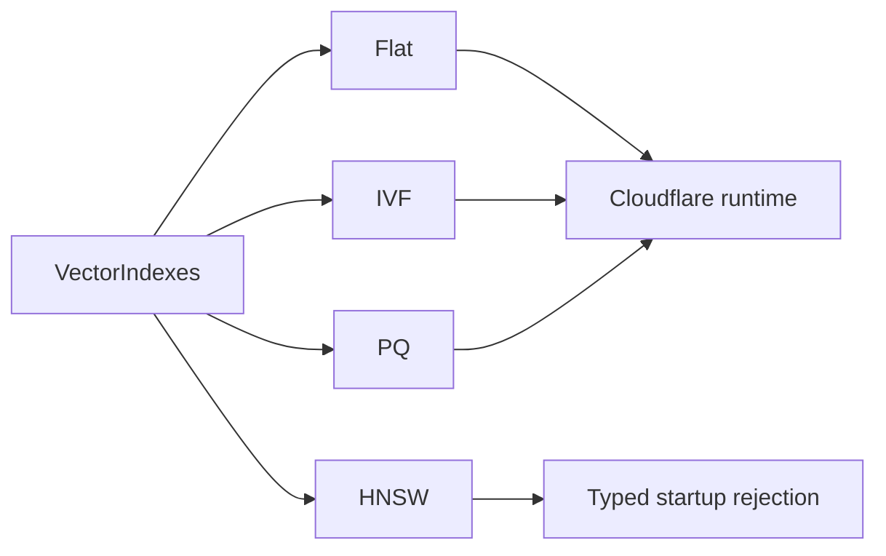
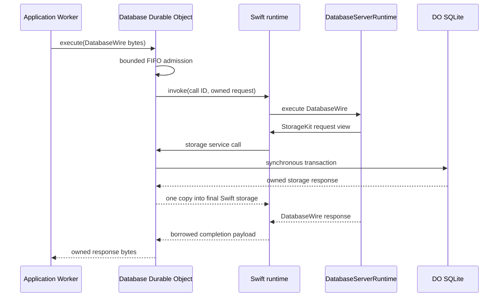

# database-framework-cloudflare

Cloudflare deployment support for the full
[`database-framework`](https://github.com/1amageek/database-framework) runtime.

An application compiles its schema, migrations, indexes, commands, and server
services into a Swift 6.4 Embedded WASM reactor. A Durable Object owns one persistent
runtime instance and one SQLite database. TypeScript provides scheduling,
bounded byte transfer, and platform services; database semantics remain in
Swift.

```mermaid
flowchart LR
  Client["DatabaseWire client"] --> Worker["Application Worker"]
  Worker --> RPC["Durable Object RPC"]
  RPC --> DO["CloudflareDatabaseDurableObject"]
  DO --> Connection["DatabaseRuntimeConnection"]
  Connection --> Runtime["Application database runtime"]
  Runtime --> Server["Full DatabaseServerRuntime"]
  Server --> Storage["StorageKit engine"]
  Storage --> SQLite["Durable Object SQLite"]
```



## Design boundaries

| Layer | Responsibility |
|---|---|
| `database-kit` | Foundation-independent values, QueryIR, and canonical DatabaseWire |
| `database-framework` | DBContainer, graph and SPARQL execution, relationships, ontology, SHACL, indexes, and server services |
| `storage-kit` | Durable Object storage client, storage transport contract, and SQLite adapter |
| `database-framework-cloudflare` Swift | Application composition, full runtime lifecycle, zero-copy request ownership, scheduling, and completion |
| `database-framework-cloudflare` TypeScript | Durable Object RPC, FIFO admission, runtime services, resource limits, and terminal failure handling |

DatabaseWire and the StorageKit transport remain separate protocols. TypeScript
does not parse DatabaseWire operations or implement queries, schemas, indexes,
or transactions.

## Swift product

The package exports one library product, `CloudflareDatabase`.

| API | Responsibility |
|---|---|
| `CloudflareDatabaseApplication` | Supplies the application storage partition identity, unopened container definition, migrations, and server configuration |
| `CloudflareDatabaseApplicationComposition` | Preserves the application-specific factories behind a stable runtime owner |
| `CloudflareDatabaseRuntime` | Serializes startup, DatabaseWire invocations, and alarm work through the full server runtime |
| `CloudflareDatabaseRuntimeCommandChannel` | Submits synchronous boundary commands to the actor-owned runtime |
| `CloudflareDatabaseRuntimeEntrypoint` | Owns one application runtime and implements operations called by the application's fixed exports |
| `DatabaseInvocationPayloadOwnership` | Transfers request payload ownership into immutable `ByteString` owners without rematerializing the frame |
| `CloudflareDatabaseTaskScheduler` | Runs Swift concurrency tasks through Cloudflare timers |
| `CloudflareDatabaseClockService` | Suspends and resumes monotonic Swift clock waits |

The application implements `CloudflareDatabaseApplication` and constructs a
`CloudflareDatabaseRuntimeEntrypoint` in its reactor target. There is no generic
runtime artifact: application schema and command registration are compile-time
dependencies.

Applications with a versioned schema pass their migration plan in the unopened
container definition. The Cloudflare runtime validates host capabilities,
opens storage, attaches the plan, and runs `migrateIfNeeded()` before serving a
DatabaseWire request:

```swift
func makeContainerDefinition() async throws
    -> CloudflareDatabaseContainerDefinition {
    CloudflareDatabaseContainerDefinition(
        schema: try ApplicationSchemaV1.makeSchema(),
        migrationPlan: ApplicationMigrationPlan.self,
        runtimeConfiguration: try ApplicationRuntime.configuration(),
        security: .disabled,
        databaseName: "application-database",
        monotonicClock: ApplicationMonotonicClock(),
        wallClock: ApplicationWallClock()
    )
}
```

The initializer without `migrationPlan` remains the explicit choice for an
unversioned schema. Storage ownership remains in the runtime in both cases;
the application returns a definition rather than an opened `DBContainer`.

## Runtime feature traits

Runtime feature selection is a compile-time application decision. This package
exposes the same index and relationship trait names as `database-framework` and
forwards only the selected traits to that dependency.

| Trait | Linked framework capability |
|---|---|
| `ScalarIndexes` | Scalar indexes |
| `VectorIndexes` | Flat, IVF, PQ, and the linked SwiftHNSW implementation; Cloudflare execution supports Flat/IVF/PQ only |
| `FullTextIndexes` | Full-text indexes |
| `SpatialIndexes` | Spatial indexes |
| `RankIndexes` | Rank indexes |
| `BitmapIndexes` | Bitmap indexes |
| `VersionIndexes` | Version indexes |
| `PermutedIndexes` | Permuted indexes |
| `GraphIndexes` | Graph, ontology, SPARQL, and required scalar indexes |
| `AggregationIndexes` | Aggregation indexes |
| `LeaderboardIndexes` | Leaderboard indexes |
| `Relationships` | Relationship indexes |

`AllRuntimeFeatures` enables every feature and remains the package default for
general development. An application-specific reactor disables default traits
and selects only its compiled schema and query requirements. Storage backend
selection is not a runtime feature trait here: every Cloudflare reactor uses
the StorageKit Durable Object adapter.

## Vector index hosting capability

`VectorIndexes` is not split into host-specific products or traits. The
Cloudflare runtime instead validates the application container definition
before `DBContainer.open`:



Cloudflare limits each isolate to 128 MB including WebAssembly allocations.
HNSW graph restoration, live graph ownership, and snapshot replacement cannot
be guaranteed within the remaining shared budget. Every effective HNSW
configuration is therefore unsupported. This applies to every configuration
whose canonical execution options resolve to HNSW, including custom
`IndexRuntimeConfiguration` values. An unconfigured vector index continues to
use the framework default, Flat. Bootstrap fails before migrations and index
initialization. The runtime does not silently substitute Flat, IVF, or PQ.

This hosting restriction does not change the framework-level HNSW contract for
native or unconstrained WASM hosts. See
[ADR-0002](Docs/ADR-0002-cloudflare-vector-capabilities.md) for the decision and
verification contract.

## TypeScript package

The Worker package is in
[`Workers/CloudflareDatabaseRuntime`](Workers/CloudflareDatabaseRuntime).

| API | Responsibility |
|---|---|
| `CloudflareDatabaseDurableObject` | Owns SQLite migration, runtime initialization, FIFO admission, and RPC execution |
| `DatabaseRuntimeConnection` | Connects typed runtime endpoints to Cloudflare services and enforces terminal failure semantics |
| `DatabaseRuntimeProgram` | Application-supplied executable runtime program |
| `DatabaseRuntimeEndpoints` | Semantic runtime operations after fixed ABI validation |
| `DatabaseRuntimePayloadOwnership` | Enforces payload ownership transitions and runtime address-space limits |
| `DatabaseTaskScheduler` | Schedules immediate and delayed runtime tasks |
| `DatabaseClockService` | Owns cancellable monotonic waits |
| `DurableObjectDatabaseAlarmScheduler` | Persists the next wake-up through Durable Object storage |

An application Durable Object supplies its compiled runtime program:

```ts
import runtimeProgram from "./CalendarDatabaseRuntime.wasm";
import {
  CloudflareDatabaseDurableObject,
  type DatabaseRuntimeLimitEnvironment,
} from "@database-framework-cloudflare/cloudflare-database-runtime";

interface Environment extends DatabaseRuntimeLimitEnvironment {}

export class CalendarDatabaseDurableObject
  extends CloudflareDatabaseDurableObject<Environment> {
  constructor(state: DurableObjectState, environment: Environment) {
    super(state, environment, runtimeProgram);
  }
}
```

Application Workers call `execute(Uint8Array)` through a Durable Object binding.
Public administration endpoints, authentication, and storage-partition routing
belong to the application Worker, not this package.

## Runtime flow



The normative fixed boundary and ownership rules are documented in
[`Docs/ADR-0001-full-runtime-reactor-abi.md`](Docs/ADR-0001-full-runtime-reactor-abi.md).

## Zero-copy ownership

| Path | Ownership rule |
|---|---|
| Worker RPC request | FIFO admission retains the incoming backing store and accounts for its full retained size |
| JavaScript to Swift invocation | One runtime allocation is filled, then ownership transfers to Swift |
| Swift request decode | `DatabaseInvocationPayloadOwnership` creates an immutable payload owner; decoders use constant-time ranges |
| Swift to JavaScript storage request | JavaScript borrows the runtime view only for the synchronous service call |
| JavaScript to Swift storage response | The response is copied once between heaps into a runtime-owned allocation |
| Swift completion to JavaScript | JavaScript copies once because the Swift owner may end when the service call returns |

No intermediate whole-frame `Array`, `Data`, or JSON representation is part of
the runtime path.

## Lifecycle and failure invariants

1. Durable Object construction migrates SQLite and creates the runtime inside
   `blockConcurrencyWhile`.
2. Startup validates host capabilities before opening `DBContainer`, then
   completes only after StorageKit, migrations, application readiness checks,
   and the full `DatabaseServerRuntime` are ready. The verification application
   executes Flat, IVF, and PQ write/index/query/cleanup checks when
   `VectorIndexes` is selected; HNSW has a separate bootstrap-rejection check.
3. Invocations and alarms use one FIFO queue, and Swift prevents concurrent
   runtime entry as a second invariant.
4. Timeout, invalid completion, host scheduler failure, clock failure, or
   ownership violation terminally poisons the runtime connection and aborts
   the Durable Object generation. A completed Swift scheduled-work failure is
   nonterminal and remains visible to Durable Object alarm retry handling.
5. Initialization failure clears the cached connection promise so a later
   Durable Object generation can retry from persistent SQLite state.
6. Before scheduled work starts, the host persists a safety alarm. Successful
   work replaces it with the exact next wake requested by Swift or removes it
   when no work remains. Failed or timed-out work leaves the safety alarm
   durable and remains visible to Cloudflare retry behavior.

## Configuration

| Environment value | Default | Responsibility |
|---|---:|---|
| `DATABASE_MAX_REQUEST_BYTES` | `4194304` | Maximum DatabaseWire request |
| `DATABASE_MAX_RESPONSE_BYTES` | `4194304` | Maximum DatabaseWire response |
| `DATABASE_MAX_PENDING_REQUESTS` | `64` | Maximum admitted requests, including the active request |
| `DATABASE_MAX_QUEUED_REQUEST_BYTES` | `16777216` | Maximum aggregate retained request backing bytes |
| `DATABASE_INVOCATION_TIMEOUT_MILLISECONDS` | `30000` | Terminal deadline for startup, invocation, or alarm completion |
| `DATABASE_ALARM_RECOVERY_DELAY_MILLISECONDS` | `60000` | Safety wake retained when one alarm delivery fails; must exceed the invocation deadline |

`DatabaseRuntimeConnectionLimits` also bounds storage frames, runtime
payload reservations, runtime address space, scheduled tasks, clock waits, and WASI
iovec traversal. Applications may tighten these limits but cannot exceed the
compiled protocol maxima.

## Development

The release manifest resolves every Swift dependency from a published Git tag.
An adjacent checkout may be selected only through an explicit local SwiftPM
development override; it is never committed in `Package.swift`:

```text
Database/
├── database-kit/
├── database-framework/
├── storage-kit/
└── database-framework-cloudflare/
```

Run focused native verification with a bounded `xcodebuild` invocation:

```bash
sh scripts/xcodebuild-timeout.sh 600 \
  xcodebuild test -quiet \
  -scheme database-framework-cloudflare-Package \
  -destination 'platform=macOS,arch=arm64' \
  -only-testing:CloudflareDatabaseTests
```

Run Worker verification:

```bash
cd Workers/CloudflareDatabaseRuntime
npm install
npm run typecheck
npm test
```

The full feasibility gate also launches workerd twice against one persisted
Durable Object state directory. It verifies Durable Object RPC, the full Swift
reactor, StorageKit SQLite, an OWL projection queried through SPARQL, and both
document and RDF-index visibility after process restart. When `VectorIndexes`
is selected, startup must exercise Flat, IVF, and PQ through their actual
write/index/query/delete paths. A separate negative fixture must prove that an
effective HNSW configuration is rejected before container opening. The gate
still requires both `VectorIndex.o` and `SwiftHNSW.o`, so it verifies the
coherent feature closure without treating link presence as execution support:

```bash
sh scripts/verify-runtime-feasibility.sh
```

Latest verified `AllRuntimeFeatures` result with the 2026-07-23 Swift 6.4
snapshot:

| Measurement | Result |
| --- | ---: |
| Optimized reactor | 9,145,363 bytes |
| Gzip-compressed reactor | 3,164,818 bytes |
| WebAssembly address space | 67,108,864 bytes |
| Startup | 98.061 ms |
| workerd Durable Object RPC | Passed |
| SQLite persistence after restart | Passed |

The same fixture executes Flat, IVF, and PQ and rejects HNSW before storage
engine creation. Native package verification passes all 27 Cloudflare tests.

The gate defaults to `AllRuntimeFeatures`. Set `DATABASE_RUNTIME_TRAITS` to a
comma-separated trait list for an application-specific artifact:

```bash
DATABASE_RUNTIME_TRAITS=GraphIndexes \
  sh scripts/verify-runtime-feasibility.sh
```

Build the application-specific runtime with
`swift-6.4.x-DEVELOPMENT-SNAPSHOT-2026-07-23-a` and the matching
`swift-6.4.x-DEVELOPMENT-SNAPSHOT-2026-07-23-a_wasm-embedded` SDK. A host
compiler and SDK from different snapshots are not binary-module compatible.
The release gate also rejects
`DatabaseTypesFoundation`, `DatabaseKitFoundation`, `StorageKitFoundation`, and
native database backends if they appear in the reactor link inputs. It requires
each selected feature product and rejects every unselected feature product in
the same link manifest before executing ABI, size, and workerd checks. Reactor
debug metadata is disabled because it is not shipped and because the pinned
cross-toolchain cannot validate host-built dependency DWARF; compiler
diagnostics and all runtime checks remain enabled.

## Repository layout

```text
Sources/
├── CloudflareDatabase/
│   ├── CloudflareDatabaseRuntime.swift
│   ├── CloudflareDatabaseRuntimeCommandChannel.swift
│   ├── CloudflareDatabaseRuntimeEntrypoint.swift
│   ├── DatabaseInvocationPayloadOwnership.swift
│   └── ...
└── CloudflareDatabaseTaskScheduling/
    ├── TaskScheduling.c
    └── include/CloudflareDatabaseTaskScheduling.h
Tests/
└── CloudflareDatabaseTests/
Workers/
└── CloudflareDatabaseRuntime/
    ├── src/
    └── test/
Docs/
└── ADR-0001-full-runtime-reactor-abi.md
```
