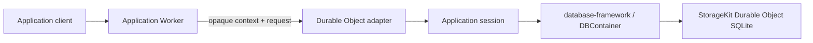

# database-framework-cloudflare

Cloudflare Durable Object adapter for an application-specific
[`database-framework`](https://github.com/1amageek/database-framework)
database compiled as a Swift Embedded WASM reactor.

This package supplies Cloudflare lifecycle, storage, scheduling, bounded byte
transfer, and completion handling. The application owns its schema, migrations,
security interpretation, request protocol, routing, and response encoding.



`database-framework-cloudflare` does not depend on `database-server`, does not
launch the standalone `database-server` daemon, and does not interpret
DatabaseWire.
An application may choose DatabaseWire as its own protocol, but that choice is
outside this adapter.

## Package boundary

| Package | Ownership |
|---|---|
| `database-kit` | Models, schemas, queries, and other database semantic declarations |
| `database-framework` | `DBContainer`, transactions, persistence, indexes, graph, ontology, SHACL, migrations, and maintenance primitives |
| `storage-kit` | Storage contracts and the Durable Object SQLite adapter |
| `database-framework-cloudflare` | Durable Object lifecycle, reactor ABI, FIFO admission, storage host ABI, clocks, alarms, and byte ownership |
| Application | Schema, migration plan, runtime composition, authentication interpretation, protocol codec, routing, and deployment configuration |

## Swift application contract

The library product is `CloudflareDatabase`. An application provides two
things:

1. A `CloudflareDatabaseConfiguration` used to open its `DBContainer` on Durable
   Object storage.
2. A `CloudflareDatabaseSession` that interprets opaque invocation bytes and
   uses that container.

The application target depends on `CloudflareDatabase` and `DatabaseRuntime`.
`DatabaseRuntime` re-exports the framework engine, schema declarations,
primitive values, and only the runtime feature modules selected by package
traits. `CloudflareDatabase` re-exports the two Cloudflare storage
configuration values used by its public application API. The adapter still does
not own the application's schema or runtime feature selection.

```swift
import CloudflareDatabase
import DatabaseRuntime

struct CalendarDatabaseApplication: CloudflareDatabaseApplication {
    var configuration: CloudflareDatabaseConfiguration {
        get async throws {
            CloudflareDatabaseConfiguration(
                partitionIdentity: try StoragePartitionIdentity(
                    databaseID: "calendar"
                ),
                schema: try CalendarSchemaV1.makeSchema(),
                migrationPlan: CalendarMigrationPlan.self,
                runtimeConfiguration: try CalendarRuntime.configuration(),
                security: .enabled()
            )
        }
    }

    func makeSession(
        for database: DBContainer
    ) async throws -> CalendarDatabaseSession {
        let bootstrapAuthorization = AuthorizationContext.authenticated(
            Principal(identifier: "calendar-bootstrap", roles: [])
        )
        try await database.admin(authorization: bootstrapAuthorization)
            .migrateIfNeeded()
        CalendarDatabaseSession(database: database)
    }
}

actor CalendarDatabaseSession: CloudflareDatabaseSession {
    let database: DBContainer

    func respond(
        to invocation: CloudflareDatabaseInvocation
    ) async throws -> ByteString {
        try await CalendarRequestHandler(database: database).respond(
            context: invocation.context,
            request: invocation.request
        )
    }

    func shutdown() async {}
}
```

`migrationPlan` is application-owned. Opening the container attaches the plan
and closes ordinary data-operation admission; it does not run an unbounded
migration inside the Cloudflare adapter. The application must either complete
the migration during `makeSession(for:)`, as above, or return a session that
only exposes its own bounded maintenance workflow until migration completion.
Partial, failed, or cancelled migration execution keeps ordinary data
operations closed. With `MultiBase`, provision or select each application
Base and migrate it through that Base's `AdminContext`; admission reopens only
after every active Base matches the compiled schema and physical index
generation.

## SwiftWeb service composition

Adding this package to a SwiftWeb application's SwiftPM dependencies also makes
its `sweb` adapter discoverable. The database runs as an independent service:

```json
{
  "schemaVersion": 3,
  "application": {
    "product": "CalendarPage",
    "module": "CalendarPage",
    "type": "CalendarPage"
  },
  "services": {
    "database": {
      "application": {
        "product": "CalendarDatabaseRuntime",
        "module": "CalendarDatabaseRuntime",
        "type": "CalendarDatabaseApplication"
      },
      "adapter": "database-framework-cloudflare/database",
      "adapterTraits": ["GraphIndexes"],
      "variables": {
        "cloudflare.bindingName": "DATABASE",
        "cloudflare.className": "CalendarDatabaseObject",
        "cloudflare.databaseID": "calendar",
        "cloudflare.objectName": "production",
        "cloudflare.workerName": "calendar-database"
      }
    }
  },
  "environments": {
    "production": {
      "host": "swift-web-cloudflare/page-worker",
      "deployment": "swift-web-cloudflare/page-worker",
      "services": ["database"]
    }
  }
}
```

```text
sweb build
├── page application -> page Worker WASM
└── database service -> Embedded database WASM + Durable Object Worker

sweb deploy
├── database Worker
└── page Worker with an external Durable Object binding
```

The generated database launcher constructs the selected
`CloudflareDatabaseApplication`, so that application type must be publicly
default-initializable. Application overlays may replace the generic Worker
surface with administration, import, or protocol-specific routing while the
adapter continues to own the runtime host and lifecycle commands.

Wrangler binding types are generated inside the isolated service workspace
after materialization and before TypeScript checking. They are build artifacts,
not application overlay inputs; an application therefore excludes a checked-in
`worker-configuration.d.ts` from its service overlay instead of copying a stale
environment definition into the generated Worker.

The runtime build command is entered whenever the `build`, `dev`, or `deploy`
pipeline requires the reactor. SwiftPM retains its incremental object cache,
while the adapter deliberately avoids declaring `database.wasm` fresh from
launcher timestamps alone; changes to application schema and session sources
must be evaluated before a deployment can reuse the artifact.
The build selects the exact Binaryen `131.0.0` npm package when invoking
`wasm-opt`; it never resolves an unversioned optimizer package.

| Service variable | Meaning |
|---|---|
| `database.maximumMemoryBytes` | Fixed initial and maximum reactor memory |
| `cloudflare.workerName` | Independently deployed database Worker name |
| `cloudflare.className` | Exported Durable Object class |
| `cloudflare.bindingName` | Database Worker's own Durable Object namespace binding |
| `cloudflare.databaseID` | Application database identity exposed to the Worker |
| `cloudflare.maximumCompressedWorkerBytes` | Deployment plan's compressed Worker upload limit; defaults to the Free-plan 3 MiB limit |
| `cloudflare.objectName` | Named Durable Object workspace selected by the application |

`sweb dev` builds the database reactor before it starts the database Worker and
page Worker as separate persistent processes. This matches Wrangler's local
model for an external Durable Object; the page binding still uses the
application's `script_name` configuration. The service reactor uses the same
`-Osize` and whole-module optimization contract as the package feasibility gate
and applies the pinned Binaryen optimizer. The deployment gate defaults to the
Free-plan 3 MiB limit; deployments that explicitly require another plan set
`cloudflare.maximumCompressedWorkerBytes` to that plan's limit. The gate is
evaluated only after Wrangler bundles the complete Worker, including JavaScript,
WebAssembly, and every uploaded module. A compressed WASM measurement is
diagnostic data and is not accepted as deployment-size evidence.

`CloudflareDatabaseInvocation.context` and `.request` are bounded immutable
bytes. The adapter never assigns authentication or wire semantics to either
payload. Application failures complete with `applicationFailed` and do not
poison the runtime; ABI, ownership, timeout, and scheduler failures remain host
failures.

`CloudflareDatabaseSession.handleAlarm()` has a typed unavailable default.
Applications that use Durable Object alarms implement that method directly on
their session. Alarm policy and persisted work remain application
responsibilities.

## Storage composition

The default composition owns one ordinary database root and transfers one
Durable Object storage engine to `DBContainer`.

The optional `MultiBase` trait adds an explicit Cloudflare storage layout:

```swift
let storageLayout = try CloudflareDatabaseStorageLayout(
    domainID: DatabaseStorageDomain.ID("primary"),
    domainNamespacePath: ["database", "calendar"],
    placementID: Base.Placement.ID("default"),
    baseNamespacePath: ["bases"]
)
```

`MultiBase` is not enabled by `AllRuntimeFeatures`. The application must
select it explicitly.

## Runtime feature traits

The package forwards only explicitly selected framework traits. There is no
default feature set, so a small application does not link unrelated runtime
features.

| Trait | Framework capability |
|---|---|
| `ScalarIndexes` | Scalar indexes |
| `VectorIndexes` | Vector indexes; Cloudflare rejects effective HNSW configurations before storage opens |
| `FullTextIndexes` | Full-text indexes |
| `SpatialIndexes` | Spatial indexes |
| `RankIndexes` | Rank indexes |
| `BitmapIndexes` | Bitmap indexes |
| `VersionIndexes` | Version indexes |
| `GraphIndexes` | Graph, ontology, and SPARQL execution |
| `AggregationIndexes` | Aggregation indexes |
| `LeaderboardIndexes` | Leaderboard indexes |
| `Relationships` | Relationship maintenance |
| `AllRuntimeFeatures` | All feature traits above, excluding `MultiBase` |
| `MultiBase` | Optional Base and Composition topology |

Runtime composition and container parameters remain separate.
`DatabaseRuntimeConfiguration` owns compiled executors, entity runtimes, and
the `IndexRuntimeConfiguration` values that select index execution policy.
`CloudflareDatabaseConfiguration` owns only host and container parameters and
passes the complete runtime configuration to `DBContainer` unchanged.

## Worker package and private ABI

The TypeScript package is in
[`Workers/CloudflareDatabaseRuntime`](Workers/CloudflareDatabaseRuntime).
`CloudflareDatabaseDurableObject.invoke(requestBytes, contextBytes)` forwards
two opaque payloads to the persistent reactor.

The application executable owns the concrete
`CloudflareDatabaseRuntimeEntrypoint` and the thin exported functions listed
below, because only the application can supply its
`CloudflareDatabaseApplication`. The adapter library owns the reusable
entrypoint implementation and ABI behavior; it does not create a generic
server executable or select an application schema.

Private reactor ABI v3 exports:

| Export | Purpose |
|---|---|
| `database_abi_version` | Reports ABI version `3` before startup |
| `database_alloc` / `database_dealloc` | Transfers invocation payload ownership |
| `database_start` | Opens storage, `DBContainer`, and the application session |
| `database_invoke` | Submits context and request bytes |
| `database_alarm` | Delivers one application alarm |
| `database_shutdown` | Drains work and closes session and container |
| `database_executor_run` | Resumes scheduled Swift work |
| `database_clock_resume` | Resumes a monotonic clock wait |

The storage host ABI remains a separate StorageKit protocol. TypeScript does
not implement schema, transaction, query, index, graph, migration, or security
semantics.

## Validation

```bash
cd Workers/CloudflareDatabaseRuntime
npm ci
npm run typecheck
npm test
cd ../..
node scripts/verify-service-adapter.mjs
scripts/xcode-test-harness
DATABASE_CLOUDFLARE_TEST_TRAITS=MultiBase scripts/xcode-test-harness
DATABASE_CLOUDFLARE_TEST_TRAITS=AllRuntimeFeatures scripts/xcode-test-harness
sh scripts/verify-runtime-feasibility.sh
```

The Xcode harness copies the package into an isolated work root before selecting
the requested trait graph, so the source manifest remains unchanged. The
standard, `MultiBase`, and `AllRuntimeFeatures` graphs require exactly 18,
20, and 21 passed tests respectively, with zero failures, skips, expected
failures, or runtime warnings. The Worker suite requires exactly 120 passed
tests. The
feasibility gate builds an application-specific reactor, validates ABI v3 and
the selected link graph, performs a real typed `DBContainer` write/read through
Durable Object SQLite, and repeats the read after a workerd restart. It also
enforces Worker size, address-space, startup, ownership, and platform adapter
constraints.

The complete responsibility and dependency decision is recorded in
[ADR-0003](Docs/ADR-0003-framework-adapter-and-standalone-server-boundaries.md).

The rationale for keeping the Durable Object host, Embedded WASM runtime,
ABI, StorageKit bridge, scheduling, and lifecycle coordination as one cohesive
adapter is recorded in
[ADR-0004](Docs/ADR-0004-cohesive-cloudflare-database-runtime.md). This package
does not become a SwiftWeb actor host: a Cloudflare Durable Object is an
actor-shaped platform endpoint, while Swift `DistributedActor` and
`ActorGroup` remain SwiftWeb responsibilities.
