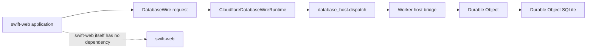
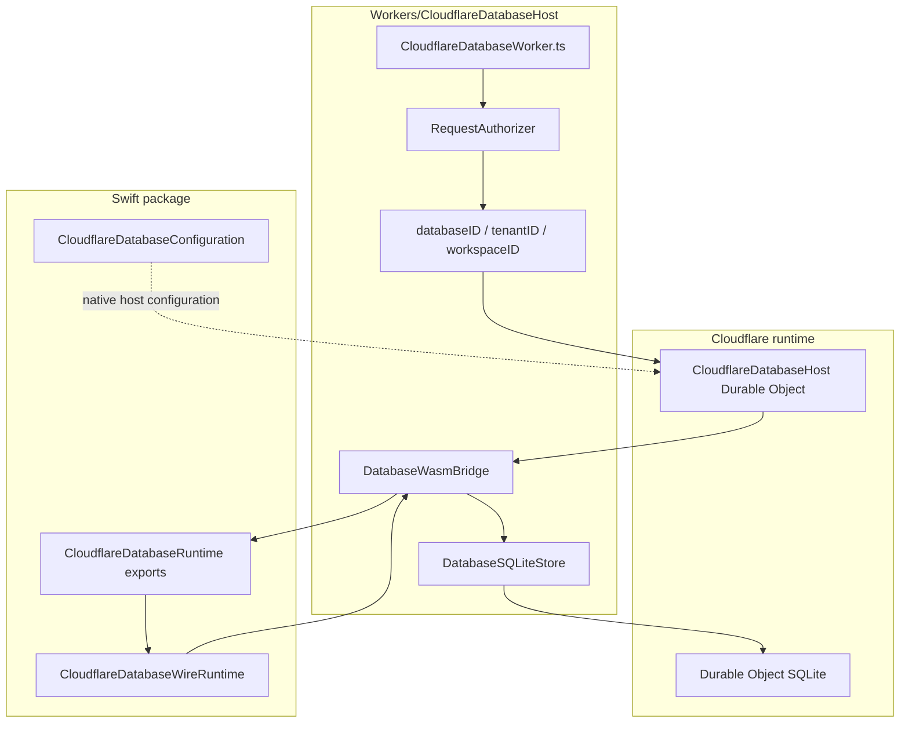
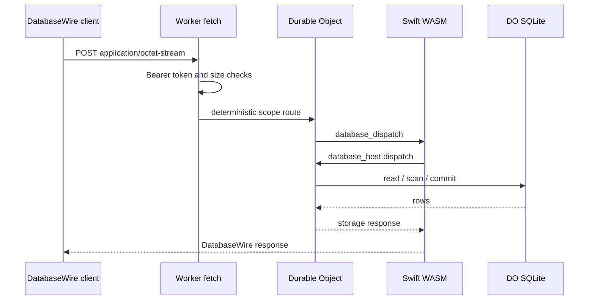
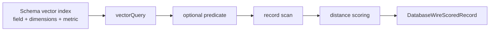

# database-framework-cloudflare

Cloudflare adapter package for [`database-framework`](https://github.com/1amageek/database-framework).

This repository provides the Cloudflare-specific layer that lets a Swift web service use the database ecosystem on Cloudflare Workers with Durable Object SQLite. It contains a Swift package, a Swift WASM runtime target, and a Worker host that routes `DatabaseWire` requests into Durable Object storage.



## Status

| Area | Status |
|---|---|
| Repository | Public source repository |
| Swift package | Tagged release package |
| Dependencies | GitHub URL dependencies pinned to released ecosystem versions |
| Cloudflare Worker | Local E2E and dry-run validated |
| Production release | Ready for dependency-consistent release; staging deploy validation remains environment-specific |

The current `Package.swift` references released ecosystem packages:

```swift
.package(url: "https://github.com/1amageek/database-framework.git", from: "26.0629.0", traits: [])
.package(url: "https://github.com/1amageek/database-kit.git", from: "26.0629.0")
.package(url: "https://github.com/1amageek/storage-kit.git", from: "26.0629.0")
```

Use adjacent local checkouts only while developing changes across the ecosystem before tagging.

## Package Responsibilities

| Package | Responsibility |
|---|---|
| `database-kit` | `DatabaseWire` DTOs, schema metadata, binary codec |
| `database-framework` | Storage-neutral runtime contracts, query evaluation, `DBContainer` facade |
| `storage-kit` | Durable Object storage engine and binary storage host protocol |
| `database-framework-cloudflare` | Cloudflare configuration, Swift WASM ABI, Worker host, Durable Object routing, authorization, request limits, Cloudflare smoke tests |

This package is not a fork of `database-framework`. It is the Cloudflare deployment adapter.

## Products

| Product | Type | Purpose |
|---|---|---|
| `CloudflareDatabase` | Library | Public Swift API for Cloudflare runtime/configuration |
| `CloudflareDatabaseRuntime` | Executable | WASM-exported runtime entrypoint used by the Worker host |

## Architecture



There are two supported integration shapes:

| Shape | Environment | API surface |
|---|---|---|
| WASM runtime | Cloudflare Workers | `DatabaseWire` through `CloudflareDatabaseWireRuntime` |
| Native host | macOS / Linux / iOS host process | `DBContainer` with `CloudflareDatabaseConfiguration` |

`swift-web` itself does not depend on this package. A web service built with `swift-web` can add this package when it needs Cloudflare database access.

## Cloudflare WASM Runtime

For Swift code compiled to WebAssembly inside Cloudflare Workers, use the wire runtime. This path avoids `URLSession`, `FoundationNetworking`, and host networking APIs.

```swift
import CloudflareDatabase
import DatabaseWire

let database = CloudflareDatabaseWireRuntime()
let response = try database.execute(.query(request))
```

`DatabaseWire` is the stable boundary for the WASM runtime. The runtime sends storage reads, scans, and commits through the imported `database_host.dispatch` function, which the TypeScript Worker host implements against Durable Object SQLite.

## Native Host Configuration

Native applications that can use the normal `Database` facade configure `DBContainer` with a Cloudflare storage backend.

```swift
import CloudflareDatabase
import CloudflareDurableObjectStorage
import Database
import Foundation

let transport = CloudflareDurableObjectHTTPTransport(
    endpoint: databaseEndpointURL,
    headers: [
        ("authorization", "Bearer \(databaseAccessToken)")
    ]
)

let client = CloudflareDurableObjectBinaryClient(transport: transport)
let configuration = try CloudflareDatabaseConfiguration(
    databaseID: "main",
    tenantID: tenantID,
    workspaceID: workspaceID,
    client: client
)

let container = try await DBContainer(
    for: schema,
    configuration: configuration
)
```

After initialization, application code continues to use the normal database APIs. The backend-specific part is isolated to the configuration value.

## Worker Host

The Worker host lives in [`Workers/CloudflareDatabaseHost`](Workers/CloudflareDatabaseHost).



### Scope Routing

Requests are routed to one Durable Object instance by deterministic scope headers:

| Header | Required | Purpose |
|---|---:|---|
| `x-database-id` | No, defaults to `main` | Logical database |
| `x-tenant-id` | No | Tenant partition |
| `x-workspace-id` | No | Workspace partition |

The same `databaseID / tenantID / workspaceID` route to the same Durable Object. Different scopes are isolated.

### Authorization

Every `POST` request must include:

| Header | Purpose |
|---|---|
| `Authorization: Bearer <token>` | Must match the `DATABASE_ACCESS_TOKEN` Worker secret |
| `Content-Type: application/octet-stream` | DatabaseWire binary payload |

Configure the production secret before deploy:

```bash
cd Workers/CloudflareDatabaseHost
wrangler secret put DATABASE_ACCESS_TOKEN
```

For local development, copy the example file:

```bash
cp .dev.vars.example .dev.vars
```

### Request Limits

`DATABASE_MAX_REQUEST_BYTES` controls the maximum accepted DatabaseWire request size. The default Worker configuration sets it to `4194304`.

The Worker validates `Content-Length` when present and also enforces the limit while streaming the request body.

## Storage Semantics

| Area | Behavior |
|---|---|
| Persistence | Durable Object SQLite |
| Migration | Constructor-time SQLite migration through `blockConcurrencyWhile` |
| Commit | Synchronous SQLite writes inside the Durable Object |
| Query | Batched range scan with post-filtering in Swift WASM |
| Query limit `0` | Unlimited at storage level, preserving DatabaseWire post-filter semantics |
| Routing | One Durable Object per deterministic logical database scope |

## Query And Vector Support

The Cloudflare runtime supports:

| Operation | Status |
|---|---|
| `applySchema` | Supported |
| `putRecord` | Supported |
| `getRecord` | Supported |
| `query` | Supported with predicate post-filtering |
| `vectorQuery` | Supported as exact flat search over stored records |

Vector queries are schema-declared:



The runtime validates:

| Validation | Behavior |
|---|---|
| Schema exists | Missing schema returns an execution failure envelope |
| Vector index exists | The queried field must have a vector index descriptor |
| Dimensions | Query and record vectors must match declared dimensions |
| Metric | Query metric must match declared schema parameter |
| Values | Non-finite or non-numeric vector values are rejected |

HNSW / IVF / PQ maintainers remain part of the native `database-framework` path. They are not embedded into this Cloudflare WASM runtime.

## Development Setup

Expected adjacent checkout layout:

```text
Database/
├── database-framework/
├── database-framework-cloudflare/
├── database-kit/
└── storage-kit/
```

Requirements:

| Tool | Purpose |
|---|---|
| Swift 6.3.1 | Native and WASM builds |
| Swift SDK `swift-6.3.1-RELEASE_wasm` | WebAssembly build target |
| Node.js | TypeScript Worker tests and smoke scripts |
| Wrangler 4.105.0 | Cloudflare Worker local/dev/deploy flow |

Install Worker dependencies:

```bash
cd Workers/CloudflareDatabaseHost
npm install
```

## Validation

Run from the repository root:

```bash
swiftly run swift test +6.3.1
swiftly run swift build --build-tests +6.3.1
swiftly run swift build --swift-sdk swift-6.3.1-RELEASE_wasm --product CloudflareDatabaseRuntime -c release +6.3.1
```

Run Worker validation:

```bash
cd Workers/CloudflareDatabaseHost
npm test
npm run smoke:e2e
npm run smoke:local:persistence
npm run deploy:dry-run
```

The Worker tests build the Swift WASM runtime, copy the generated `.wasm` into `src/`, and then run the selected test or deploy command. The generated `.wasm` file is ignored by Git.

### Verified Coverage

| Command | Coverage |
|---|---|
| `swift test` | Swift storage host codec, configuration, runtime query behavior |
| `npm test` | TypeScript host limits, authorization, SQLite host, Swift WASM bridge |
| `npm run smoke:e2e` | Wrangler local Worker, authorization, scope routing, query matrix, vector query, malformed request envelope |
| `npm run smoke:local:persistence` | Durable Object SQLite persistence across local Wrangler restart |
| `npm run deploy:dry-run` | Cloudflare bundle generation and binding validation |

## Deployment

```bash
cd Workers/CloudflareDatabaseHost
wrangler secret put DATABASE_ACCESS_TOKEN
npm run deploy
```

`wrangler.jsonc` defines:

| Binding | Resource |
|---|---|
| `DATABASE_DURABLE_OBJECT` | `CloudflareDatabaseHost` Durable Object |
| `DATABASE_MAX_REQUEST_BYTES` | Request size limit |

The Durable Object migration uses SQLite-backed classes:

```jsonc
{
  "migrations": [
    {
      "tag": "v1",
      "new_sqlite_classes": ["CloudflareDatabaseHost"]
    }
  ]
}
```

## Release Checklist

Before tagging a production release:

| Requirement | Status |
|---|---|
| Public repository | Done |
| Local path dependencies replaced with tagged GitHub dependencies | Done |
| `database-kit`, `database-framework`, and `storage-kit` tags fixed | Done |
| Worker package version policy decided | CalVer, aligned with database-framework ecosystem |
| Cloudflare staging deployment validated | Required |
| README commands re-run from a clean clone | Required |

## Repository Layout

```text
Sources/
├── CloudflareDatabase/
│   ├── CloudflareDatabaseConfiguration.swift
│   ├── CloudflareDatabaseWireRuntime.swift
│   ├── CloudflareDatabaseWireStorage.swift
│   ├── CloudflareDurableObjectHost.swift
│   └── WasmMemory.swift
├── CloudflareDatabaseRuntime/
│   ├── DatabaseRuntimeDispatcher.swift
│   └── DatabaseRuntimeExports.swift
Tests/
└── CloudflareDatabaseTests/
Workers/
└── CloudflareDatabaseHost/
    ├── src/
    ├── test/
    ├── scripts/
    ├── package.json
    └── wrangler.jsonc
```

## License

No license file is currently included.
