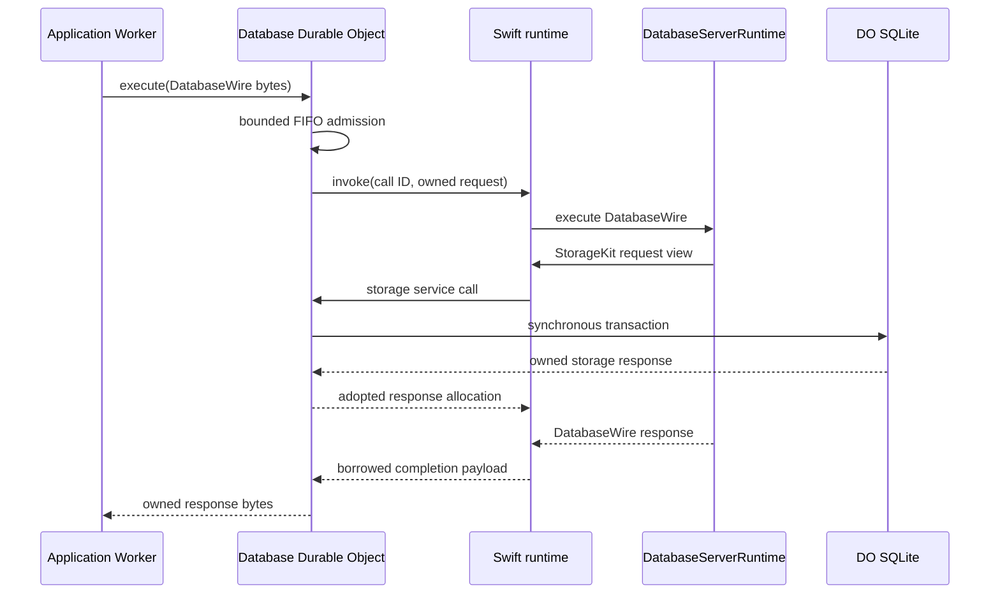

# database-framework-cloudflare

Cloudflare deployment support for the full
[`database-framework`](https://github.com/1amageek/database-framework) runtime.

An application compiles its schema, migrations, indexes, commands, and server
services into a standard WASI reactor. A Durable Object owns one persistent
runtime instance and one SQLite database. TypeScript provides scheduling,
bounded byte transfer, and platform services; database semantics remain in
Swift.

```mermaid
flowchart LR
  Client["DatabaseWire client"] --> Worker["Application Worker"]
  Worker --> RPC["Durable Object RPC"]
  RPC --> DO["CloudflareDatabaseDurableObject"]
  DO --> Connection["DatabaseRuntimeConnection"]
  Connection --> Runtime["Application database runtime"]
  Runtime --> Server["Full DatabaseServerRuntime"]
  Server --> Storage["StorageKit engine"]
  Storage --> SQLite["Durable Object SQLite"]
```



## Design boundaries

| Layer | Responsibility |
|---|---|
| `database-kit` | Foundation-independent values, QueryIR, and canonical DatabaseWire |
| `database-framework` | DBContainer, graph and SPARQL execution, relationships, ontology, SHACL, indexes, and server services |
| `storage-kit` | Durable Object storage client, storage transport contract, and SQLite adapter |
| `database-framework-cloudflare` Swift | Application composition, full runtime lifecycle, zero-copy request ownership, scheduling, and completion |
| `database-framework-cloudflare` TypeScript | Durable Object RPC, FIFO admission, runtime services, resource limits, and terminal failure handling |

DatabaseWire and the StorageKit transport remain separate protocols. TypeScript
does not parse DatabaseWire operations or implement queries, schemas, indexes,
or transactions.

## Swift product

The package exports one library product, `CloudflareDatabase`.

| API | Responsibility |
|---|---|
| `CloudflareDatabaseApplication` | Supplies the application storage scope, DBContainer, migrations, and server configuration |
| `CloudflareDatabaseApplicationComposition` | Preserves the application-specific factories behind a stable runtime owner |
| `CloudflareDatabaseRuntime` | Serializes startup, DatabaseWire invocations, and alarm work through the full server runtime |
| `CloudflareDatabaseRuntimeCommandChannel` | Submits synchronous boundary commands to the actor-owned runtime |
| `CloudflareDatabaseRuntimeEntrypoint` | Owns one application runtime and implements operations called by the application's fixed exports |
| `DatabaseInvocationPayloadOwnership` | Transfers request payload ownership into immutable `DatabaseBytes` owners without rematerializing the frame |
| `CloudflareDatabaseTaskScheduler` | Runs Swift concurrency tasks through Cloudflare timers |
| `CloudflareDatabaseClockService` | Suspends and resumes monotonic Swift clock waits |

The application implements `CloudflareDatabaseApplication` and constructs a
`CloudflareDatabaseRuntimeEntrypoint` in its reactor target. There is no generic
runtime artifact: application schema and command registration are compile-time
dependencies.

## TypeScript package

The Worker package is in
[`Workers/CloudflareDatabaseRuntime`](Workers/CloudflareDatabaseRuntime).

| API | Responsibility |
|---|---|
| `CloudflareDatabaseDurableObject` | Owns SQLite migration, runtime initialization, FIFO admission, and RPC execution |
| `DatabaseRuntimeConnection` | Connects typed runtime endpoints to Cloudflare services and enforces terminal failure semantics |
| `DatabaseRuntimeProgram` | Application-supplied executable runtime program |
| `DatabaseRuntimeEndpoints` | Semantic runtime operations after fixed ABI validation |
| `DatabaseRuntimePayloadOwnership` | Enforces payload ownership transitions and runtime address-space limits |
| `DatabaseTaskScheduler` | Schedules immediate and delayed runtime tasks |
| `DatabaseClockService` | Owns cancellable monotonic waits |
| `DurableObjectDatabaseAlarmScheduler` | Persists the next wake-up through Durable Object storage |

An application Durable Object supplies its compiled runtime program:

```ts
import runtimeProgram from "./CalendarDatabaseRuntime.wasm";
import {
  CloudflareDatabaseDurableObject,
  type DatabaseRuntimeLimitEnvironment,
} from "@database-framework-cloudflare/cloudflare-database-runtime";

interface Environment extends DatabaseRuntimeLimitEnvironment {}

export class CalendarDatabaseDurableObject
  extends CloudflareDatabaseDurableObject<Environment> {
  constructor(state: DurableObjectState, environment: Environment) {
    super(state, environment, runtimeProgram);
  }
}
```

Application Workers call `execute(Uint8Array)` through a Durable Object binding.
Public administration endpoints, authentication, and scope selection belong to
the application Worker, not this package.

## Runtime flow



The normative fixed boundary and ownership rules are documented in
[`Docs/ADR-0001-full-runtime-reactor-abi.md`](Docs/ADR-0001-full-runtime-reactor-abi.md).

## Zero-copy ownership

| Path | Ownership rule |
|---|---|
| Worker RPC request | FIFO admission retains the incoming backing store and accounts for its full retained size |
| JavaScript to Swift invocation | One runtime allocation is filled, then ownership transfers to Swift |
| Swift request decode | `DatabaseInvocationPayloadOwnership` creates an immutable payload owner; decoders use constant-time ranges |
| Swift to JavaScript storage request | JavaScript borrows the runtime view only for the synchronous service call |
| JavaScript to Swift storage response | The response is copied once between heaps into a runtime-owned allocation |
| Swift completion to JavaScript | JavaScript copies once because the Swift owner may end when the service call returns |

No intermediate whole-frame `Array`, `Data`, or JSON representation is part of
the runtime path.

## Lifecycle and failure invariants

1. Durable Object construction migrates SQLite and creates the runtime inside
   `blockConcurrencyWhile`.
2. Startup completes only after StorageKit, migrations, DBContainer, and the
   full `DatabaseServerRuntime` are ready.
3. Invocations and alarms use one FIFO queue, and Swift prevents concurrent
   runtime entry as a second invariant.
4. Timeout, invalid completion, scheduler failure, clock failure, or ownership
   violation terminally poisons the runtime connection and aborts the Durable
   Object generation.
5. Initialization failure clears the cached connection promise so a later
   Durable Object generation can retry from persistent SQLite state.
6. Alarm completion waits for `setAlarm` persistence; failures remain visible
   to Cloudflare retry behavior.

## Configuration

| Environment value | Default | Responsibility |
|---|---:|---|
| `DATABASE_MAX_REQUEST_BYTES` | `4194304` | Maximum DatabaseWire request |
| `DATABASE_MAX_RESPONSE_BYTES` | `4194304` | Maximum DatabaseWire response |
| `DATABASE_MAX_PENDING_REQUESTS` | `64` | Maximum admitted requests, including the active request |
| `DATABASE_MAX_QUEUED_REQUEST_BYTES` | `16777216` | Maximum aggregate retained request backing bytes |
| `DATABASE_INVOCATION_TIMEOUT_MILLISECONDS` | `30000` | Terminal deadline for startup, invocation, or alarm completion |

`DatabaseRuntimeConnectionLimits` also bounds storage frames, runtime
payload reservations, runtime address space, scheduled tasks, clock waits, and WASI
iovec traversal. Applications may tighten these limits but cannot exceed the
compiled protocol maxima.

## Development

Adjacent local checkouts are used while the v1 ecosystem is under active
development:

```text
Database/
├── database-kit/
├── database-framework/
├── storage-kit/
└── database-framework-cloudflare/
```

Run focused native verification with a bounded `xcodebuild` invocation:

```bash
sh scripts/xcodebuild-timeout.sh 600 \
  xcodebuild test -quiet \
  -scheme database-framework-cloudflare \
  -destination 'platform=macOS' \
  -only-testing:CloudflareDatabaseTests
```

Run Worker verification:

```bash
cd Workers/CloudflareDatabaseRuntime
npm install
npm run typecheck
npm test
```

Build the application-specific runtime with a Swift 6.4 host toolchain and its
matching WASI SDK. A host compiler and SDK from different snapshots are not
binary-module compatible.

## Repository layout

```text
Sources/
├── CloudflareDatabase/
│   ├── CloudflareDatabaseRuntime.swift
│   ├── CloudflareDatabaseRuntimeCommandChannel.swift
│   ├── CloudflareDatabaseRuntimeEntrypoint.swift
│   ├── DatabaseInvocationPayloadOwnership.swift
│   └── ...
└── CloudflareDatabaseTaskScheduling/
    ├── TaskScheduling.c
    └── include/CloudflareDatabaseTaskScheduling.h
Tests/
└── CloudflareDatabaseTests/
Workers/
└── CloudflareDatabaseRuntime/
    ├── src/
    └── test/
Docs/
└── ADR-0001-full-runtime-reactor-abi.md
```
