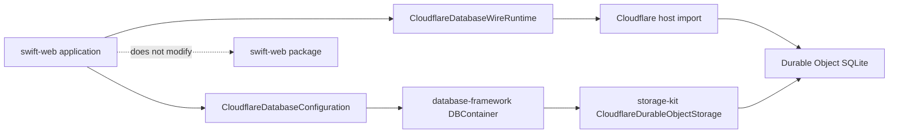
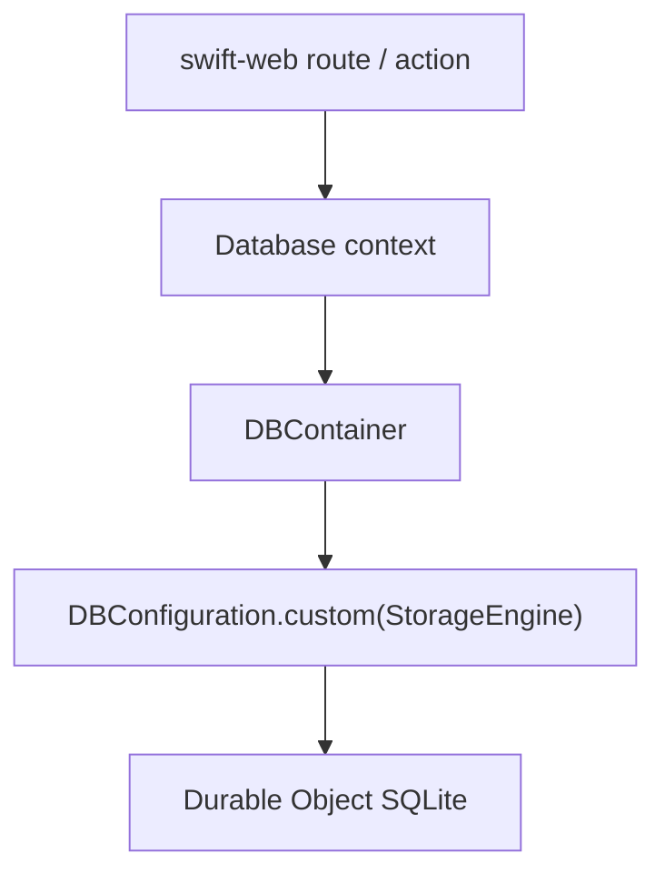
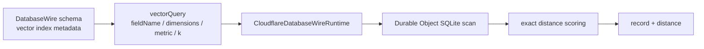

# database-framework-cloudflare

Cloudflare adapter package for `database-framework`.



## Responsibilities

| Package | Responsibility |
|---|---|
| `database-kit` | `DatabaseWire` DTOs and binary codec |
| `database-framework` | Storage-neutral `DatabaseEngineRuntime` and query predicate evaluation |
| `database-framework-cloudflare` | Cloudflare configuration adapter for `DBContainer`, Swift WASM ABI, Worker authorization, request limits, and wrangler E2E |
| `storage-kit` | Durable Object SQLite storage engine and binary storage host protocol |

`swift-web` itself does not depend on this package. A web service built with
`swift-web` depends on `database-framework-cloudflare`. On Cloudflare/WASM it
uses the wire runtime directly; in a native host process it supplies the
Cloudflare storage configuration when it creates its database container.

## Cloudflare WASM Initialization

For a Swift service running inside Cloudflare Workers/WASM, use the runtime
that talks to the Durable Object host boundary directly. This path does not
require `URLSession`, `FoundationNetworking`, or a dependency from `swift-web`
itself.

```swift
import CloudflareDatabase
import DatabaseWire

let database = CloudflareDatabaseWireRuntime()
let response = try database.execute(.query(request))
```

`DatabaseWire` is the WASM-safe contract for this runtime. The full
`DBContainer` facade in `database-framework` is still host-only while that
module keeps its `#if !os(WASI)` boundary.

## Native Application Initialization

For a native service that can use the normal `Database` facade, initialize
`DBContainer` with the Cloudflare configuration. This is the same shape as the
other backend-specific configurations: the application changes only the
configuration value.

```swift
import CloudflareDatabase
import CloudflareDurableObjectStorage
import Database
import Foundation

let transport = CloudflareDurableObjectHTTPTransport(
    endpoint: databaseEndpointURL,
    headers: [
        ("authorization", "Bearer \(databaseAccessToken)")
    ]
)
let client = CloudflareDurableObjectBinaryClient(transport: transport)
let configuration = try CloudflareDatabaseConfiguration(
    databaseID: "main",
    tenantID: tenantID,
    workspaceID: workspaceID,
    client: client
)

let container = try await DBContainer(
    for: schema,
    configuration: configuration
)
```

The only backend-specific value passed to `database-framework` is the
configuration. After initialization, application code continues to use the
normal database APIs.

`databaseEndpointURL`, `databaseAccessToken`, `tenantID`, and `workspaceID`
belong to the application configuration or secret store.



## Runtime Boundary

The Cloudflare WASM runtime uses a concrete `CloudflareDatabaseWireRuntime` to avoid unstable protocol witness dispatch across the WASM host boundary. The storage-neutral runtime remains in `database-framework`; both runtimes share the same `DatabaseWire` contracts and are covered by matching query and vector tests.

## Vector Query Support

`DatabaseWire` includes a schema-declared `vectorQuery` operation for Cloudflare/WASM:



The Cloudflare runtime currently executes exact flat vector search over records
stored in Durable Object SQLite. It validates that the schema has a matching
vector index descriptor with `dimensions` and `metric` parameters, applies the
optional wire predicate before ranking, and returns `DatabaseWireScoredRecord`
values sorted by distance.

HNSW / IVF / PQ index maintainers remain part of the native `database-framework`
`DBContainer` path. They are not embedded into the Cloudflare WASM runtime.

## Commands

```bash
swiftly run swift test --filter CloudflareDatabase +6.3.1
swiftly run swift build --build-tests +6.3.1
swiftly run swift build --swift-sdk swift-6.3.1-RELEASE_wasm --product CloudflareDatabaseRuntime -c release +6.3.1
cd Workers/CloudflareDatabaseHost
npm install
npm test
npm run smoke:e2e
npm run smoke:local:persistence
npm run deploy:dry-run
```

The lower-level Durable Object SQLite storage host is validated in
`../storage-kit`:

```bash
swiftly run swift test --filter CloudflareDurableObjectStorage +6.3.1
cd Workers/CloudflareDurableObjectStorageHost
npm test
npm run smoke:e2e
npm run smoke:local:persistence
npm run deploy:dry-run
```

Before a real deploy, configure the host secrets:

```bash
# database-framework-cloudflare/Workers/CloudflareDatabaseHost
wrangler secret put DATABASE_ACCESS_TOKEN

# storage-kit/Workers/CloudflareDurableObjectStorageHost
wrangler secret put STORAGEKIT_ACCESS_TOKEN
```
