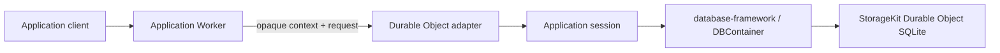

# database-framework-cloudflare

Cloudflare Durable Object adapter for an application-specific
[`database-framework`](https://github.com/1amageek/database-framework)
database compiled as a Swift Embedded WASM reactor.

This package supplies Cloudflare lifecycle, storage, scheduling, bounded byte
transfer, and completion handling. The application owns its schema, migrations,
security interpretation, request protocol, routing, and response encoding.



`database-framework-cloudflare` does not depend on `database-server`, does not
launch the standalone `database-server` daemon, and does not interpret
DatabaseWire.
An application may choose DatabaseWire as its own protocol, but that choice is
outside this adapter.

## Package boundary

| Package | Ownership |
|---|---|
| `database-kit` | Models, schemas, queries, and other database semantic declarations |
| `database-framework` | `DBContainer`, transactions, persistence, indexes, graph, ontology, SHACL, migrations, and maintenance primitives |
| `storage-kit` | Storage contracts and the Durable Object SQLite adapter |
| `database-framework-cloudflare` | Durable Object lifecycle, reactor ABI, FIFO admission, storage host ABI, clocks, alarms, and byte ownership |
| Application | Schema, migration plan, runtime composition, authentication interpretation, protocol codec, routing, and deployment configuration |

## Swift application contract

The library product is `CloudflareDatabase`. An application provides two
things:

1. A `CloudflareDatabaseDefinition` used to open its `DBContainer` on Durable
   Object storage.
2. A `CloudflareDatabaseSession` that interprets opaque invocation bytes and
   uses that container.

The application target depends directly on `CloudflareDatabase` and on the
framework and declaration products used by its composition. This direct
dependency is intentional: the adapter does not hide or own the application's
schema and runtime feature selection.

```swift
import CloudflareDatabase
import DatabaseEngine
import DatabaseKit
import DatabaseRuntime
import DatabaseTypes
import StorageKit

struct CalendarDatabaseApplication: CloudflareDatabaseApplication {
    func makeDefinition() async throws -> CloudflareDatabaseDefinition {
        CloudflareDatabaseDefinition(
            partitionIdentity: try StoragePartitionIdentity(
                databaseID: "calendar"
            ),
            schema: try CalendarSchemaV1.makeSchema(),
            migrationPlan: CalendarMigrationPlan.self,
            runtimeConfiguration: try CalendarRuntime.configuration(),
            security: .enabled()
        )
    }

    func makeSession(
        for container: DBContainer
    ) async throws -> CalendarDatabaseSession {
        CalendarDatabaseSession(container: container)
    }
}

actor CalendarDatabaseSession: CloudflareDatabaseSession {
    let container: DBContainer

    func respond(
        to invocation: CloudflareDatabaseInvocation
    ) async throws -> ByteString {
        try await CalendarRequestHandler(container: container).respond(
            context: invocation.context,
            request: invocation.request
        )
    }

    func shutdown() async {}
}
```

`CloudflareDatabaseInvocation.context` and `.request` are bounded immutable
bytes. The adapter never assigns authentication or wire semantics to either
payload. Application failures complete with `applicationFailed` and do not
poison the runtime; ABI, ownership, timeout, and scheduler failures remain host
failures.

`CloudflareDatabaseSession.handleAlarm()` has a typed unavailable default.
Applications that use Durable Object alarms implement that method directly on
their session. Alarm policy and persisted work remain application
responsibilities.

## Storage composition

The default composition owns one ordinary database root and transfers one
Durable Object storage engine to `DBContainer`.

The optional `MultipleBases` trait adds an explicit Cloudflare storage layout:

```swift
let storageLayout = try CloudflareDatabaseStorageLayout(
    domainID: DatabaseStorageDomain.ID("primary"),
    domainNamespacePath: ["database", "calendar"],
    placementID: Base.Placement.ID("default"),
    baseNamespacePath: ["bases"]
)
```

`MultipleBases` is not enabled by `AllRuntimeFeatures`. The application must
select it explicitly.

## Runtime feature traits

The package forwards only explicitly selected framework traits. There is no
default feature set, so a small application does not link unrelated runtime
features.

| Trait | Framework capability |
|---|---|
| `ScalarIndexes` | Scalar indexes |
| `VectorIndexes` | Vector indexes; Cloudflare rejects effective HNSW configurations before storage opens |
| `FullTextIndexes` | Full-text indexes |
| `SpatialIndexes` | Spatial indexes |
| `RankIndexes` | Rank indexes |
| `BitmapIndexes` | Bitmap indexes |
| `VersionIndexes` | Version indexes |
| `PermutedIndexes` | Permuted indexes |
| `GraphIndexes` | Graph, ontology, and SPARQL execution |
| `AggregationIndexes` | Aggregation indexes |
| `LeaderboardIndexes` | Leaderboard indexes |
| `Relationships` | Relationship maintenance |
| `AllRuntimeFeatures` | All feature traits above, excluding `MultipleBases` |
| `MultipleBases` | Optional Base and Composition topology |

## Worker package and private ABI

The TypeScript package is in
[`Workers/CloudflareDatabaseRuntime`](Workers/CloudflareDatabaseRuntime).
`CloudflareDatabaseDurableObject.invoke(requestBytes, contextBytes)` forwards
two opaque payloads to the persistent reactor.

The application executable owns the concrete
`CloudflareDatabaseRuntimeEntrypoint` and the thin exported functions listed
below, because only the application can supply its
`CloudflareDatabaseApplication`. The adapter library owns the reusable
entrypoint implementation and ABI behavior; it does not create a generic
server executable or select an application schema.

Private reactor ABI v3 exports:

| Export | Purpose |
|---|---|
| `database_abi_version` | Reports ABI version `3` before startup |
| `database_alloc` / `database_dealloc` | Transfers invocation payload ownership |
| `database_start` | Opens storage, `DBContainer`, and the application session |
| `database_invoke` | Submits context and request bytes |
| `database_alarm` | Delivers one application alarm |
| `database_shutdown` | Drains work and closes session and container |
| `database_executor_run` | Resumes scheduled Swift work |
| `database_clock_resume` | Resumes a monotonic clock wait |

The storage host ABI remains a separate StorageKit protocol. TypeScript does
not implement schema, transaction, query, index, graph, migration, or security
semantics.

## Validation

```bash
cd Workers/CloudflareDatabaseRuntime
npm ci
npm run typecheck
npm test
cd ../..
scripts/xcode-test-harness
DATABASE_CLOUDFLARE_TEST_TRAITS=MultipleBases scripts/xcode-test-harness
DATABASE_CLOUDFLARE_TEST_TRAITS=AllRuntimeFeatures scripts/xcode-test-harness
sh scripts/verify-runtime-feasibility.sh
```

The Xcode harness copies the package into an isolated work root before selecting
the requested trait graph, so the source manifest remains unchanged. The
standard, `MultipleBases`, and `AllRuntimeFeatures` graphs require exactly 18,
20, and 21 passed tests respectively, with zero failures, skips, expected
failures, or runtime warnings. The Worker suite requires exactly 120 passed
tests. The
feasibility gate builds an application-specific reactor, validates ABI v3 and
the selected link graph, performs a real typed `DBContainer` write/read through
Durable Object SQLite, and repeats the read after a workerd restart. It also
enforces Worker size, address-space, startup, ownership, and platform adapter
constraints.

The complete responsibility and dependency decision is recorded in
[ADR-0003](Docs/ADR-0003-framework-adapter-and-standalone-server-boundaries.md).
