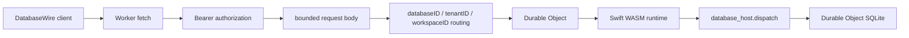

# Cloudflare Database Host

This package runs the `DatabaseWire` runtime inside a Cloudflare Worker and stores key-value rows in Durable Object SQLite.



## Scope Routing

Requests are routed to one Durable Object instance by these headers:

| Header | Required | Purpose |
|---|---:|---|
| `x-database-id` | Yes, defaults to `main` when omitted | Logical database |
| `x-tenant-id` | No | Tenant partition |
| `x-workspace-id` | No | Workspace partition |

The Durable Object name is deterministic for the same scope, so all operations for one logical database partition are serialized by the same Durable Object.

## Authorization And Limits

Every `POST` request must include:

| Header | Purpose |
|---|---|
| `Authorization: Bearer <token>` | Matches `DATABASE_ACCESS_TOKEN` |
| `Content-Type: application/octet-stream` | DatabaseWire binary payload |

`DATABASE_ACCESS_TOKEN` is a secret and must be configured with `wrangler secret put DATABASE_ACCESS_TOKEN` before production deploy. Local development can copy `.dev.vars.example` to `.dev.vars`.

`DATABASE_MAX_REQUEST_BYTES` controls the maximum accepted DatabaseWire request size. The default configured value is `4194304`.

## Storage Semantics

| Area | Behavior |
|---|---|
| Query scan limit `0` | Treated as unlimited by storage, preserving `DatabaseWire` post-filter semantics |
| Predicate query | Runtime scans storage in batches and applies the predicate before the query limit |
| SQLite schema | Initialized through Durable Object constructor migration |

## Commands

```bash
npm install
npm test
npm run smoke:e2e
npm run smoke:local:persistence
npm run deploy:dry-run
npm run deploy
```

The npm scripts build `CloudflareDatabaseRuntime.wasm` with Swift 6.3.1, copy it into `src/`, then run the selected Worker command. The copied `.wasm` file is a generated artifact and is ignored by git.

## Verified Path

`npm run smoke:e2e` starts `wrangler dev` locally and verifies:

| Area | Coverage |
|---|---|
| HTTP guard | Non-POST requests are rejected |
| Authorization guard | Missing bearer token is rejected |
| Wire execution | `applySchema`, `putRecord`, `getRecord`, and `query` round-trip through Swift WASM |
| Query predicate | Nested `and` / `or` with comparison and `contains` |
| Vector query | Schema-declared exact vector search returns nearest records with distance |
| Scope isolation | Different `tenantID` values use different Durable Objects |
| Error envelope | Malformed wire input returns a `DatabaseWire` failure response |
| Local persistence | Durable Object SQLite data survives a local wrangler restart with `--persist-to` |
