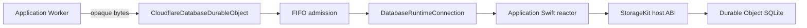

# Cloudflare Database Runtime

TypeScript host adapter for an application-specific `database-framework`
reactor running inside a Cloudflare Durable Object.



The application Worker owns HTTP routing, authentication, application context
encoding, request and response codecs, and Durable Object identity selection.
This package does not interpret DatabaseWire or authentication principals and
does not depend on `database-server`.

## APIs

| API | Responsibility |
|---|---|
| `CloudflareDatabaseDurableObject` | SQLite migration, persistent reactor creation, FIFO admission, RPC invocation, and alarm entry |
| `DatabaseRuntimeConnection` | ABI v3 validation, runtime lifecycle, payload transfer, completion delivery, timeouts, and terminal failure handling |
| `DatabaseRuntimeEntryQueue` | Bounded FIFO ownership of context and request payloads |
| `DatabaseRuntimePayloadOwnership` | Runtime allocation ownership and cumulative byte/address-space limits |
| `DatabaseTaskScheduler` | Immediate and delayed Swift task scheduling |
| `DatabaseClockService` | Cancellable monotonic waits and exactly-once resume |
| `DurableObjectDatabaseAlarmScheduler` | Durable alarm persistence |
| `WasiPreview1Host` | WASI Preview 1 host services selected by this runtime |

Application code calls:

```ts
const responseBytes = await database.invoke(requestBytes, contextBytes);
```

Both arguments are application-defined `Uint8Array` values. The adapter checks
their independent limits and forwards them without decoding.

## ABI v3

The runtime must export `database_abi_version` returning `3` before any other
operation is accepted. Invocation uses two independently owned payloads:

```text
database_invoke(
  callID,
  contextAddress,
  contextByteCount,
  requestAddress,
  requestByteCount
)
```

No v2 compatibility decoder is retained.

## Limits

| Environment value | Default | Responsibility |
|---|---:|---|
| `DATABASE_MAX_CONTEXT_BYTES` | `1048576` | Maximum opaque application context |
| `DATABASE_MAX_REQUEST_BYTES` | `4194304` | Maximum opaque application request |
| `DATABASE_MAX_RESPONSE_BYTES` | `4194304` | Maximum opaque application response |
| `DATABASE_MAX_PENDING_REQUESTS` | `64` | Active plus queued invocations |
| `DATABASE_MAX_QUEUED_REQUEST_BYTES` | `16777216` | Aggregate retained context and request backing bytes |
| `DATABASE_INVOCATION_TIMEOUT_MILLISECONDS` | `30000` | Startup, invocation, alarm, and shutdown deadline |
| `DATABASE_ALARM_RECOVERY_DELAY_MILLISECONDS` | `60000` | Safety wake after failed alarm delivery |

Compiled hard caps also bound payload ownership count and bytes, runtime address
space, scheduled tasks, clock waits, WASI iovecs, and failure payloads.

## Failure semantics

Application invocation and alarm failures are non-terminal typed completions.
An unclassified application exception is exposed as
`database.execution.runtime_failure`, while cancellation is exposed as
`database.execution.cancelled`; the host does not reinterpret either as an
application request-decoding result.
Malformed ABI completion, payload ownership violation, timeout, scheduler
failure, clock failure, or address-space violation terminally poisons the
runtime generation. The same reactor instance is not entered again after a
terminal failure.

Failure payloads use strict UTF-8. Storage and completion borrowing never lets
a pointer escape its synchronous borrow.

## Validation

```bash
npm ci
npm run typecheck
npm test
cd ../..
sh scripts/verify-runtime-feasibility.sh
```

The full gate verifies ABI v3, a real application-protocol write/read through
`DBContainer` and Durable Object SQLite, workerd RPC, persisted state after a
workerd restart, selected framework products, size, address-space, startup,
and teardown behavior. `npm test` must report exactly 120 passed tests with no
failures, cancellations, skips, or todos.

## Distribution

The package version uses npm-compatible numeric SemVer. Git release
`26.0818.0` therefore contains package version `26.818.0`. Consumers install
the immutable archive attached to that GitHub release:

```bash
npm install --save-exact https://github.com/1amageek/database-framework-cloudflare/releases/download/26.0818.0/database-framework-cloudflare-cloudflare-database-runtime-26.818.0.tgz
```

Its StorageKit host dependency is locked to the matching immutable
`storage-kit` GitHub release archive. A sibling repository checkout is not
part of the runtime installation contract.
