# Cloudflare Database Runtime

This package runs an application-specific full `database-framework` runtime
inside a Durable Object. The Durable Object owns the runtime connection and
StorageKit SQLite adapter. TypeScript supplies platform services and bounded
byte transfer; database semantics remain in Swift.

```mermaid
flowchart LR
  Worker["Application Worker"] --> RPC["Durable Object RPC"]
  RPC --> DO["CloudflareDatabaseDurableObject"]
  DO --> Queue["DatabaseRuntimeEntryQueue"]
  Queue --> Connection["DatabaseRuntimeConnection"]
  Connection --> Runtime["Application database runtime"]
  Runtime --> Storage["storage_host.dispatch / receive / discard"]
  Storage --> SQLite["Durable Object SQLite"]
```



The application selects the Durable Object name and supplies the compiled
`DatabaseRuntimeProgram`. Public HTTP endpoints and authentication belong to
the application Worker and forward the same DatabaseWire payload after policy
checks.

## Responsibilities

| API | Responsibility |
|---|---|
| `CloudflareDatabaseDurableObject` | SQLite migration, runtime initialization, FIFO admission, RPC invocation, and alarm entry |
| `DatabaseRuntimeConnection` | Runtime lifecycle, semantic endpoint validation, completion delivery, and terminal failure handling |
| `DatabaseRuntimePayloadOwnership` | Payload ownership transitions, cumulative payload limits, and address-space limits |
| `DatabaseTaskScheduler` | Immediate and delayed runtime task scheduling |
| `DatabaseClockService` | Cancellable monotonic waits and exactly-once resume |
| `DurableObjectDatabaseAlarmScheduler` | Durable alarm persistence |
| `WasiPreview1Host` | The selected WASI Preview 1 service adapter |

Persistent job wake-ups use Durable Object alarms. Swift requests an absolute
timestamp through `database_alarm.schedule`; the platform service validates
and persists it with `setAlarm`. The Durable Object `alarm()` method enters the
same FIFO queue as DatabaseWire invocations. Before entering Swift, the host
persists a safety wake. A successful delivery replaces that wake with the
earliest timestamp requested during the delivery, or deletes it when no work
remains. A failed delivery preserves the safety wake and rethrows so platform
retry and application-level recovery remain independent.

Suspending Swift tasks use `database_clock.schedule` and
`database_clock.cancel`. One `AbortController` is owned per wait, Cloudflare's
monotonic scheduler performs the wait, and `database_clock_resume` resumes only
the currently registered wait.

## Limits

| Environment value | Default | Responsibility |
|---|---:|---|
| `DATABASE_MAX_REQUEST_BYTES` | `4194304` | Maximum DatabaseWire request |
| `DATABASE_MAX_RESPONSE_BYTES` | `4194304` | Maximum DatabaseWire response |
| `DATABASE_MAX_PENDING_REQUESTS` | `64` | Maximum admitted requests, including the active request |
| `DATABASE_MAX_QUEUED_REQUEST_BYTES` | `16777216` | Maximum aggregate retained request backing bytes |
| `DATABASE_INVOCATION_TIMEOUT_MILLISECONDS` | `30000` | Terminal deadline for startup, invocation, or alarm completion |
| `DATABASE_ALARM_RECOVERY_DELAY_MILLISECONDS` | `60000` | Safety wake retained after a failed alarm delivery; must exceed the invocation deadline |

`DatabaseRuntimeConnectionLimits` applies additional independent bounds:

| Runtime limit | Default | Responsibility |
|---|---:|---|
| Request stream chunks | `1024` | Bounds stream metadata before the one required consolidation copy |
| Payloads per active invocation set | `4096` | Bounds connection-owned invocation payload reservations |
| Payload bytes per active invocation set | `33554432` | Bounds cumulative payload transfer work |
| Runtime address space | `67108864` | Rejects runtime instances whose address space exceeds the budget |
| Scheduled tasks | `4096` | Bounds retained immediate tasks and timers |
| Scheduled clock waits | `4096` | Bounds cancellable monotonic waits |
| WASI iovecs | `1024` | Bounds descriptor traversal |
| WASI iovec bytes | `1048576` | Bounds bytes acknowledged by one vector operation |

Applications may tighten these values but cannot raise them above compiled
protocol caps.

## Failure semantics

Requests enter an explicit FIFO queue. Capacity failures are typed. A timeout,
invalid completion, scheduler failure, clock failure, or ownership violation
terminally poisons the connection and aborts the Durable Object generation.
The same runtime instance is never entered again.

A scheduled-work operation that completes with `scheduledWorkFailed` does not
poison the connection. The Durable Object retains its safety wake and rethrows
the failure so the same persisted job can be attempted again. Invocation
timeouts remain terminal for the current runtime generation, while the safety
wake survives that generation.

Failure payloads use strict UTF-8. Malformed or scalar-truncated text is a
terminal protocol failure rather than a replacement-character fallback.

Alarm entry and completion wait for Durable Object alarm persistence.
Persistence failures remain visible to Cloudflare's alarm retry behavior.

## Zero-copy contract

| Boundary | Ownership |
|---|---|
| Durable Object RPC input | The request queue retains the incoming backing store and accounts for its full retained size |
| Runtime invocation input | One runtime allocation receives the request and transfers to runtime ownership |
| Runtime completion | The connection borrows the payload during completion delivery and creates one JavaScript-owned result |
| Storage request | The SQLite adapter borrows the runtime range for the synchronous dispatch only |
| Storage response | Dispatch retains an independent host response; after dispatch returns, Swift allocates final storage and receive performs one cross-heap copy |

## Validation

```bash
npm install
npm run typecheck
npm test
cd ../..
sh scripts/verify-runtime-feasibility.sh
```

The gate uses `AllRuntimeFeatures` by default. An application-specific
verification selects its compile-time runtime traits explicitly:

```bash
DATABASE_RUNTIME_TRAITS=GraphIndexes \
  sh scripts/verify-runtime-feasibility.sh
```

The feasibility gate builds the selected app-specific verification reactor
with Swift 6.4, applies `wasm-opt -Oz`, validates the fixed import/export ABI,
executes typed schema, mutation, and query requests first against the Node
reference host and then through an actual workerd Worker, Durable Object RPC,
and Durable Object SQLite. The mutation creates an OWL-class entity, and a
SPARQL ASK request must observe its generated RDF projection. The workerd
process is restarted against the same persisted state and must still return
both the inserted entity and the RDF query result. The gate also enforces
Worker size, isolate address-space, startup limits, required selected feature
products, exclusion of unselected feature products, and exclusion of host-only
adapters. A `VectorIndexes` composition additionally runs startup
write/index/query/delete checks for Flat, IVF, and PQ. A separate negative
fixture must reject HNSW before container opening. The gate still requires the
actual `VectorIndex` and `SwiftHNSW` products because the framework feature is
cohesive, while supported execution is determined by the Cloudflare capability
validator rather than link presence.

The 2026-08-07 `AllRuntimeFeatures` gate produced a 9,145,363-byte optimized
reactor (3,164,818 bytes gzip), a 67,108,864-byte address space, and a
98.061 ms startup measurement. Durable Object RPC and SQLite persistence
after a workerd restart both passed.

`SWIFT_EXECUTABLE`, `SWIFT_EMBEDDED_WASM_SDK`, and
`DATABASE_RUNTIME_BUILD_PATH` select reproducible toolchain and artifact
locations. `DATABASE_RUNTIME_TRAITS` is a comma-separated list of public
runtime feature traits. Relative build paths are resolved from the repository
root. The release gate disables index-store generation and uses one build job
so the fixed `swift-6.4.x-DEVELOPMENT-SNAPSHOT-2026-07-23-a` Embedded WASI
toolchain produces the same reactor without concurrent compiler resource
failures. Reactor debug metadata is also disabled because it is not shipped and
the pinned cross-toolchain cannot validate host-built dependency DWARF;
compiler diagnostics and all runtime checks remain enabled.

The application repository owns its concrete runtime application, production
Durable Object subclass, Wrangler configuration, routing, and authentication
policy. It runs the same workerd-backed gate for its app-specific reactor
before deployment.

The normative fixed boundary is documented in
[`Docs/ADR-0001-full-runtime-reactor-abi.md`](../../Docs/ADR-0001-full-runtime-reactor-abi.md).
